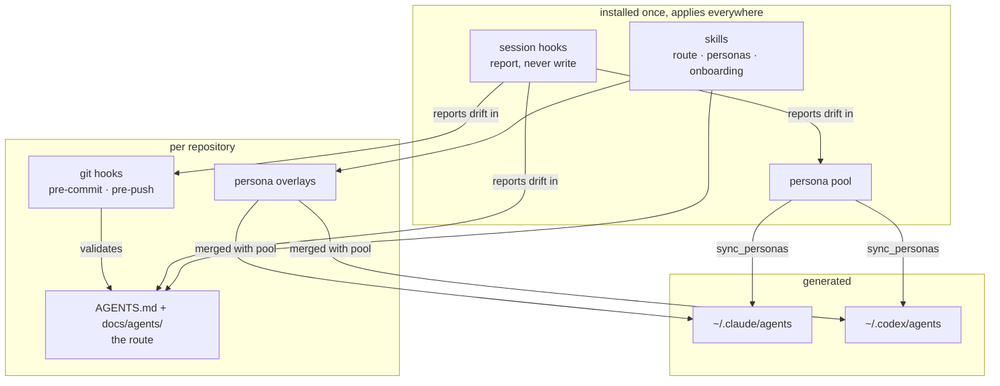

# SWE Agent

**A cross-project layer for working with coding agents: how a repository routes them, how work is
delegated to named roles, and what keeps any of it from rotting.**

Built and used by one person across a dozen projects on one laptop, with Claude Code and Codex in
parallel. Everything here is in daily use rather than proposed. Where a decision came from a
measurement, the number is included; where it came from a mistake, the mistake is written down.

## The problem

Agent setup rots invisibly. An `AGENTS.md` written in month one describes a repository that no
longer exists; a guide gets renamed and every link to it dies silently; the same reviewer role is
re-invented from scratch in every session, with a different model each time. Nothing fails loudly —
the agent just quietly does worse work, and you attribute it to the model.

Three things follow from that:

1. **A route has to be validated like code**, or it decays into confident fiction.
2. **Roles have to be defined once**, or every session re-derives them differently.
3. **Whatever is not checked will drift**, so the checks matter more than the content.

## Quickstart

```bash
cd install && ./install.sh && ./verify.sh
```

Then open a project and run the **`project-onboarding`** skill. Requirements and what gets written:
[install/README.md](install/README.md).

## What you get

| | |
|---|---|
| **A four-layer route** | Contract → index → per-directory → README, each with a word budget, all validated |
| **A repository taxonomy** | One layout across every project, with a migrator for existing repos |
| **Thirteen personas** | `scout`, `developer`, `senior-developer`, `reviewer`, `architect`, `acceptance` and others — model and effort already decided, generated into both harnesses |
| **A push guard** | Blocks credentials, oversized files, and direct pushes to main — the two rules a forge charges for, enforced locally. Fails closed: a scan that could not run exits 2 and never reads as clean |
| **An identifier guard** | For a repository that is deliberately public: blocks home paths, account identifiers, and a machine-local list of private names from the staged diff and the commit message. The list lives outside the repository it protects |
| **An environment preflight** | Asserts the facts that break scripts and gates rather than code — a tool that resolves in your shell but not in a script, a keg-only JDK, an inherited SIGHUP-ignore |
| **A vendored-drift check** | Compares the installed layer against this repository's published copy, so the two cannot silently disagree |
| **Drift detection** | Session start reports a broken route, an unsynced persona, an unmirrored rule, a stale graph |

## How it fits together



The split is deliberate: **knowledge lives in the repository** so every harness reads the same
thing, and **skills and hooks are accelerators for one harness**. A rule that lives only in a skill
silently does not apply to the other agent, and that failure is invisible.

## Documentation

| Read | For |
|---|---|
| [operating-model.md](docs/operating-model.md) | How work is sequenced, and what counts as done |
| [progressive-disclosure.md](docs/progressive-disclosure.md) | The four layers, the README contract, the validator |
| [repository-standard.md](docs/repository-standard.md) | Where files belong; migrating an existing repo |
| [github.md](docs/github.md) | Storage-only rules, the push guard, zero-cost posture |
| [agent-personas.md](docs/agent-personas.md) | The roster, and why each is routed as it is |
| [decisions.md](docs/decisions.md) | Twelve decisions, each against what it was chosen over |
| [measurements.md](docs/measurements.md) | The numbers those decisions rest on |
| [onboarding-a-project.md](docs/onboarding-a-project.md) | Five steps to bring a project under the standard |
| [full-adoption.md](docs/full-adoption.md) | The long version, with guard-testing |
| [codex.md](docs/codex.md) | The Codex side, and what it does not get |
| [what-gets-installed.md](docs/what-gets-installed.md) | Every file the installer places, and why |

## What this is not

**Not a framework.** There is no runtime, no package, no API. It is a set of markdown conventions,
a handful of skills and session hooks, and Python scripts with no dependencies outside the standard
library. Every file the installer places is enumerated in
[what-gets-installed.md](docs/what-gets-installed.md) rather than counted here — a count restated in
prose is the first thing to go stale, and the published skills are named and enforced in one place:
[docs/README.md](docs/README.md), "What is published, and what is not".

**Not model-agnostic in its details.** The persona roster names specific models at specific effort
levels. Those were chosen from measurements taken in one week of 2026 and will age. The *principles*
— effort tracks reasoning depth, model tracks stakes, frequency decides where saving matters — are
the durable part. Retune the table.

**Not team-tested.** Several decisions are correct *because* this is a one-person, one-laptop
operation and would be wrong with more people: no hosted CI, merge commits over squash, and local
git hooks standing in for branch protection. Those are marked where they appear.

**Not a substitute for reading it.** Installing an agent configuration you have not read is how you
end up with rules you do not understand and cannot debug.

## Two sections a software project would have, and this does not

The README contract this repository describes requires a *Current state* section linked to a plan,
and a *Product requirements* section linking PRDs. Neither applies to a documentation repository
with no roadmap and no product, so neither is here.

That is the point rather than an exception: a contract applied without judgement produces sections
written to satisfy a validator. Adopt the parts that answer a real question for your readers.

## Licence

MIT. See [LICENSE](LICENSE).
