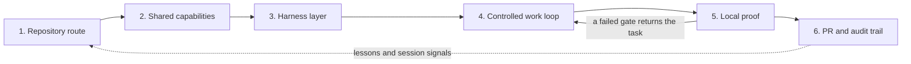

# SWE Agent

**A local-first operating layer for reliable Claude Code and Codex work. It keeps repository
instructions, roles, and verification evidence from drifting, without becoming a runtime,
framework, or hosted service.**

|  |  |
|---|---|
| **What it is** | Markdown conventions, installable skills, session and Git hooks, and Python scripts with no dependencies outside the standard library. |
| **What you get** | A validated task route, eleven active personas plus three compatibility definitions, declared writer scopes, structural no-write restrictions for judges, a bounded review loop, and local proof you can re-run. |
| **How to start** | One command, then the `project-onboarding` skill in your project. See [Quickstart](#quickstart). |
| **What it is not** | A runtime, a package, an API, or a hosted service. See [What this is not](#what-this-is-not). |

[Quickstart](#quickstart) · [Architecture](#architecture) · [Components](#components) · [Current state](#current-state) · [The problem](#the-problem) · [Documentation](#documentation) · [Working here](#working-in-this-repository) · [Improvements](#recent-improvements)

## Architecture



Repository knowledge is the durable source of truth. Shared skills accelerate both harnesses;
session signals are Claude-specific. Neither replaces repository knowledge.

| Stage | What happens | What it buys |
|---|---|---|
| 1. Repository route | A repository declares its contract and task routes in `AGENTS.md` and `docs/agents/`; the repository standard supplies the common taxonomy and a migrator. Entry points: `AGENTS.md`, `docs/agents/`, [`validate_disclosure.py`](install/skills/progressive-disclosure/scripts/validate_disclosure.py), [repository standard](docs/architecture/repository-standard.md). | Durable, shared context reduces rediscovery and makes stale links visible. |
| 2. Shared capabilities | The published vendored layer provides reusable skills; the persona pool defines role, model, effort, and write boundaries. Session signals remain Claude-only. Entry points: [published skill declaration](docs/README.md), [persona sources and generator](docs/agents/agent-personas.md), [`verify.sh`](install/verify.sh). | Repeatable work patterns and consistent role routing; the verifier can compare this repository's published layer with installed state. |
| 3. Harness layer | Claude Code and Codex consume the same repository knowledge; skills are mirrored and personas are rendered for each harness. A persona stays in the harness being driven. Entry points: [installation inventory](docs/agents/what-gets-installed.md), [`install_hooks.py`](install/skills/progressive-disclosure/scripts/install_hooks.py), [no cross-harness dispatch](docs/agents/agent-personas.md#no-cross-harness-dispatch). | One repository route works across both harnesses without cross-harness dispatch. |
| 4. Controlled work loop | Fresh, read-only review tries to falsify design and plan before their human gates; approved work then moves through scope → build → review → test in a light or full lane. Judges are independent; a builder does not approve their own work. Entry points: [operating model](docs/architecture/operating-model.md), [full adoption walkthrough](docs/runbooks/full-adoption.md). | Expensive mistakes surface before implementation, while evidence thresholds and one bounded rereview prevent review-driven scope drift. |
| 5. Local proof | Focused and adjacent tests lead to a project's area gate, then full local E2E with real services. Environment preflight and Git hooks protect commit and push; this repository's `verify.sh` proves only its published tooling and installation. Entry points: [`preflight.sh`](install/hooks/preflight.sh), [`identifier_guard.py`](install/skills/progressive-disclosure/scripts/identifier_guard.py), [`push_guard.py`](install/skills/progressive-disclosure/scripts/push_guard.py). | Local gates decide readiness; failures and unknowns are reported honestly without mistaking toolchain verification for a project's production-path proof. |
| 6. PR and audit trail | GitHub stores code and configuration; milestone PRs and merge commits preserve the audit trail after local proof. It does not run hosted CI or deploy work. Entry point: [GitHub policy](docs/runbooks/github.md). | Durable backup and history without mistaking a push for validation. |

Lessons and session signals feed corrections back into repository context. They are distinct from
machine-global Claude/Codex mirror drift and from `verify.sh`'s installed-versus-published vendored
layer comparison; all three make a stale assumption visible to the next task.

## Quickstart

```bash
cd install && ./install.sh && ./verify.sh
```

Then open a project in Claude Code or Codex and run the **`project-onboarding`** skill. Requirements
and installer behaviour: [install/README.md](install/README.md).

If this setup helps, use GitHub's **Star** button to help other builders discover it.

## Components

| Component | What it gives you | Deep dive |
|---|---|---|
| Route, repository taxonomy, and migration | A short, validated task route plus a common repository layout; the migrator plans or applies a link-preserving move into that layout. | [Progressive disclosure](docs/agents/progressive-disclosure.md) · [Repository standard](docs/architecture/repository-standard.md) |
| Codebase navigation | A queryable graph of the repository, so a task finds the file that matters instead of grepping for it. | [`graph-navigation`](install/skills/graph-navigation/SKILL.md) |
| Onboarding and shared skills | A repeatable way to add the route, per-clone hooks, and published workflows to a project; the installer mirrors shared skills to both harnesses. | [Install](install/README.md) · [Onboarding](docs/runbooks/onboarding-a-project.md) · [`project-onboarding`](install/skills/project-onboarding/SKILL.md) |
| Personas and specialists | Eleven active base personas and three retained compatibility definitions with deliberate role, model, effort, and write boundaries, generated by `agent-personas`; `agent-persona-factory` derives project specialists from the repository's guardrails, architecture, and product requirements. | [Agent personas](docs/agents/agent-personas.md) |
| Controlled execution and independent judges | Fresh review falsifies design and plan before approval; a bounded scope → build → review → test loop uses a card-free light lane or a full card, with independent approval of builder work. | [Operating model](docs/architecture/operating-model.md) |
| Conformance after onboarding | Whether a repository that was onboarded still meets the standard — personas, route, hooks, identifier guard, methodology, GitHub posture, plugin surface, preflight, and product definition — reported before anything is repaired. Run by hand, never by a hook. | [`project-conformance`](install/skills/project-conformance/SKILL.md) |
| Migration of an onboarded repository | Moving product documents written before the product-definition layer onto the bound schema: triage, a plan that writes nothing, an apply that moves with `git mv` and rewrites links, adoption, and confirmation. `status:` and `reviewed_by:` are left for a person. | [`project-migration`](install/skills/project-migration/SKILL.md) |
| Sandboxed gates | Running a write-producing gate against a manifest-equal standalone copy inside an enforced macOS profile, with a readiness phase that refuses to spend an attempt on a machine that is not ready — both what provisioning must supply and the runtime behaviours the profile must permit, which is the class a provisioning check cannot see. The profile is asserted in both directions by break-tests, and a separate Darwin-only capture primitive owns the child process and its output so a receipt survives a descendant that outlives the command. | [`gate-sandbox`](install/skills/gate-sandbox/SKILL.md) |
| Environment, drift, and learning signals | Preflight catches machine gaps; checks distinguish machine-global Claude/Codex mirror drift from installed-versus-published vendored-layer drift; repository lessons preserve corrections. | [`preflight.sh`](install/hooks/preflight.sh) · [`check_toolchain.py`](install/skills/progressive-disclosure/scripts/check_toolchain.py) · [`verify.sh`](install/verify.sh) |
| Local project proof and Git safety | Focused tests, project gates, and local E2E establish project readiness; identifier and push guards protect commit and push. | [Operating model](docs/architecture/operating-model.md) · [`identifier_guard.py`](install/skills/progressive-disclosure/scripts/identifier_guard.py) · [`push_guard.py`](install/skills/progressive-disclosure/scripts/push_guard.py) |

Optional code-graph navigation is available when `graphify` is installed; it is not required for the
route, installer, or local checks.

## Current state

The execution methodology is at **v5.1**. Model assignments are a selective pilot policy;
comparative quality, velocity and subscription efficiency are not yet established.

### What ships today

| Ships | Detail |
|---|---|
| Published skills | Named and enforced in [docs/README.md](docs/README.md), “What is published, and what is not”. |
| Generated personas | Eleven active roles; three superseded or retired definitions retained for compatibility. The roster includes each harness's model and effort. |
| Local session and Git guards | Session hooks, plus the identifier and push guards on commit and push. |
| A cross-harness installer | An explicitly invoked install mirrors shared skills to Claude Code and Codex. |
| Executable verification | `verify.sh` runs the published toolchain's suites and reports what each proved or could not run. |

### The execution procedure has one owner

The [methodology](install/skills/execution-methodology/methodology.md) defines the gates,
lanes and review outcomes. The [execution loop](install/skills/execution-methodology/references/execution-loop.md)
provides the operational commands. Persona definitions assign responsibility and permissions.

Every task declares a plan ID, lane, writes and criteria. The light lane dispatches those fields
without a card; boundary or safety work uses a strict full card. Both receive independent review
and an area check. The controller plans and maintains bounded workspace state; product edits go
to writers. Readiness comes from the existing dependency graph and git, with continuous dispatch
of independent tasks.

One initial review covers the complete task diff. Corrections receive a scoped rereview under
the two-round budget. An unresolved semantic defect remains incomplete; a final mechanical
application needs independent executable confirmation. Budgets never change safety, review,
test or acceptance verdicts. Specialist involvement follows a named invariant at the stage where
the decision is still changeable.

### Evidence and overhead are separate measurements

`spec_check.py` binds product definition, `plan_waves.py` validates task admission, dependencies
and write ownership, and `trace_check.py` connects criteria to verified test execution.
Direct validation commands, exact Gradle `--rerun-tasks`, and single-use JUnit receipts retain
their existing contracts and documented trust limits.

`ratio_meter.py` measures committed line churn. `check_review_budget.py` measures workspace
files and bytes. Neither measures total model effort or founder time. The
[measurement record](docs/product/measurements.md) distinguishes those units and the outcomes
needed to judge the pilot. Historical block rates motivate early review; they do not establish
that a wider panel causes higher quality or faster completion.

### Adoption and limits

The published candidate selects Fable 5.1/Astra for architecture, security, migration and acceptance;
ordinary builders and implementation review retain their existing tiers. The controller starts at
medium effort during execution. See the [persona guide](docs/agents/agent-personas.md) for the
complete generated roster, planning overrides and model prerequisites.

Global installation changes defaults inherited by other projects. Prepare and verify locally,
then activate deliberately. Updating a repository's rendered methodology is also an explicit
adoption step. Neither a passing unit suite nor a green push establishes release readiness.

There is no application release, deployment, or application roadmap behind this repository.
Changes still require real local gate evidence, an independent verdict, and separately authorized
commit, push and merge actions. Current verification limitations belong in the measurement record.
Historical decisions and results remain in [decisions.md](docs/decisions/decisions.md) and the
[weekly improvement record](docs/product/improvements-weekly.md).

## The problem

Agent setup rots invisibly. An `AGENTS.md` written in month one describes a repository that no
longer exists; a guide gets renamed and every link to it dies silently; the same reviewer role is
re-invented from scratch in every session, with a different model each time. Nothing fails loudly —
the agent just quietly does worse work, and you attribute it to the model.

Three things follow from that:

1. **A route has to be validated like code**, or it decays into confident fiction.
2. **Roles have to be defined once**, or every session re-derives them differently.
3. **Whatever is not checked will drift**, so the checks matter more than the content.

## Product requirements

This repository is tooling and documentation rather than an end-user application, so it does not
invent application PRDs. Its product requirements are the normative contracts below; detailed
behaviour stays in those linked documents instead of being copied into the front page.

| Requirement authority | What it defines |
|---|---|
| [Repository contract](AGENTS.md) | Public-repository boundaries, source authority, goal-bound execution, and required verification. |
| [Operating model](docs/architecture/operating-model.md) | Local-first priorities, execution stages, independent judgment, and what “done” means. |
| [Published surface](docs/README.md#what-is-published-and-what-is-not) | Which skills are deliberately vendored and which absences are known or intentional. |
| [GitHub policy](docs/runbooks/github.md) | Storage-only GitHub posture, local push protection, milestone PRs, and merge history. |

## Documentation

| Read | For |
|---|---|
| [operating-model.md](docs/architecture/operating-model.md) | How work is sequenced, and what counts as done |
| [progressive-disclosure.md](docs/agents/progressive-disclosure.md) | The four layers, the README contract, the validator |
| [repository-standard.md](docs/architecture/repository-standard.md) | Where files belong; migrating an existing repo |
| [github.md](docs/runbooks/github.md) | Storage-only rules, the push guard, zero-cost posture |
| [agent-personas.md](docs/agents/agent-personas.md) | The roster, and why each is routed as it is |
| [decisions.md](docs/decisions/decisions.md) | Decisions and rationale, each against what was chosen over |
| [measurements.md](docs/product/measurements.md) | The numbers those decisions rest on |
| [improvements-weekly.md](docs/product/improvements-weekly.md) | The full weekly improvement record, newest first |
| [onboarding-a-project.md](docs/runbooks/onboarding-a-project.md) | Five steps to bring a project under the standard |
| [full-adoption.md](docs/runbooks/full-adoption.md) | The long version, with guard-testing |
| [codex.md](docs/runbooks/codex.md) | The Codex side, and what it does not get |
| [what-gets-installed.md](docs/agents/what-gets-installed.md) | Every file the installer places, and why |

## Working in this repository

Start with [AGENTS.md](AGENTS.md), then use [docs/README.md](docs/README.md) to open only the guide
needed for the task. The executable tooling in `install/` is authoritative. Changes to a vendored
skill or hook originate in its maintained user-level source and are then re-vendored; the exact
inventory and exceptions are documented in [what-gets-installed.md](docs/agents/what-gets-installed.md).

Before review, run the complete local gate:

```bash
cd install && ./install.sh --dry-run && ./verify.sh
```

GitHub stores the resulting code and configuration; it does not validate or deploy them. Changes
land through milestone-sized pull requests, with an honest README, real local-gate output, an
independent review, and a merge commit that preserves the audit trail. See
[github.md](docs/runbooks/github.md) for the push guard and zero-cost forge rules.

## Recent improvements

The three most recent entries are below. The full record, and every earlier entry, is in
[docs/product/improvements-weekly.md](docs/product/improvements-weekly.md). Current tooling remains the authority
for behaviour; each entry points to the implementation it describes.

| Week | Entry |
|---|---|
| 5 September 2026 | [v5.1: one task procedure and a selective model pilot](docs/product/improvements-weekly.md#week-of-5-september-2026--v51-one-task-procedure-and-a-selective-model-pilot) |
| 21 August 2026 | [v5.0: the milestone runs itself, and a review rule was falsified](docs/product/improvements-weekly.md#week-of-21-august-2026--v50-the-milestone-runs-itself-and-a-review-rule-was-falsified) |
| 21 August 2026 | [The product-definition checks reach a boundary that fires](docs/product/improvements-weekly.md#week-of-21-august-2026--the-product-definition-checks-reach-a-boundary-that-fires) |

**v5.1 — one task procedure and a selective model pilot.** Lane admission, review transitions and
terminal states have one canonical owner. The persona roster derives active and compatibility
status from maintained definitions. The model assignments are a local, unmeasured pilot; global
installation remains a separate adoption step.

**v5.0 — the milestone runs itself, and a review rule was falsified.** Execution became a written
procedure of ten steps checked against the real commands, and state is derived from git rather than
held in a ledger. A card's declared write set is now compared to the working tree before the commit:
on real cards, 116 of 558 files had landed outside what the card allowed. The one-reviewer rule was
falsified by its own record — across 1,051 review artifacts, design blocks at 0.74 per artifact
against 0.09 at implementation — so width is now scoped by stage.

**The product-definition checks reach a boundary that fires.** `spec_check.py` and `plan_waves.py`
moved from commands into the `pre-push` hook, at a median cost of 154 ms on a repository holding 204
product documents. A repository with no `docs/product/` gets silence, because a gate that blocks a
push in a repository that never opted in gets uninstalled. `milestone_seal.py --record M<n>`
receipts a cross-feature validation run against HEAD's tree object.

## What this is not

**Not a framework.** There is no runtime, no package, no API. It is a set of markdown conventions,
a handful of skills and session hooks, and Python scripts with no dependencies outside the standard
library. Every file the installer places is enumerated in
[what-gets-installed.md](docs/agents/what-gets-installed.md) rather than counted here — a count restated in
prose is the first thing to go stale, and the published skills are named and enforced in one place:
[docs/README.md](docs/README.md), "What is published, and what is not".

**Not model-agnostic in its details.** The generated persona roster names specific models and effort
levels. The current changes are candidate settings for a selective pilot, not evidence that one
model is generally better. Retune them only from dated prices, harness support and matched local
outcome evidence.

**Not team-tested.** Several decisions are correct *because* this is a one-person, one-laptop
operation and would be wrong with more people: no hosted CI, merge commits over squash, and local
git hooks standing in for branch protection. Those are marked where they appear.

**Not a substitute for reading it.** Installing an agent configuration you have not read is how you
end up with rules you do not understand and cannot debug.

## README design choices

The README contract is applied to the questions readers actually have. The diagram leads, because a
reader deciding whether this is real should see the shape before the prose. *Current state*
describes the shipped toolchain and its known publication gap in short sections rather than one
block. *Product requirements* routes to this repository's normative contracts instead of inventing
application PRDs for a project with no application runtime. The weekly improvement record is a
record: it accretes, so it lives in [its own document](docs/product/improvements-weekly.md) and the front
page carries only the newest entries. The full contract and validator live in
[progressive-disclosure.md](docs/agents/progressive-disclosure.md).

If this local-first setup helps your agent work hold together, use GitHub's **Star** button to help
other builders discover it.

## Licence

MIT. See [LICENSE](LICENSE).
