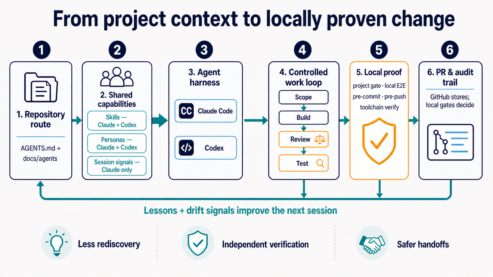

# SWE Agent

**A local-first operating layer for reliable Claude Code and Codex work. It keeps repository
instructions, roles, and verification evidence from drifting—without becoming a runtime, framework,
or hosted service.**

It is a set of conventions and installable tooling for routing agents, assigning accountable roles,
and proving work locally. Current tooling is authoritative; measured decisions and mistakes stay in
the documentation so the setup can be inspected rather than trusted on faith.

[Quickstart](#quickstart) · [Current state](#current-state) · [Product requirements](#product-requirements) · [Components](#components) · [Architecture](#architecture) · [Working here](#working-in-this-repository) · [Weekly improvements](#weekly-improvements)

If this setup helps, use GitHub's **Star** button to help other builders discover it.

## Quickstart

```bash
cd install && ./install.sh && ./verify.sh
```

Then open a project in Claude Code or Codex and run the **`project-onboarding`** skill. Requirements
and installer behaviour: [install/README.md](install/README.md).

## Current state

The repository currently ships six published skills, fourteen generated personas, local session and
Git guards, a cross-harness installer, and executable verification for the published toolchain. The
execution methodology is at v5.0: the process has a spending limit, a script enforces it, the
product definition it protects is checkable, the plan that turns a feature into tasks is scheduled
rather than described, and the milestone that plan belongs to can be executed without a human
deciding each dispatch. Committed churn splits three ways — product, product
thinking, and process — and `ratio_meter.py` warns at a 15% process share and fails a merge at 30%,
with a volume floor below which a quiet week cannot fail at all. `weekly_review.py` reports the
trend across repositories. Product definition is never capped: a repository writing its PRD and
feature specs has a low product share by design, and only bookkeeping is bounded. `spec_check.py`
holds the other half — one PRD, its feature specs, and the milestone that states the goal no single
feature owns, each stating what is true now rather than accumulating what it used to say — and binds
a newly exposed route to the Surface section of an approved feature spec, so a module the PRD
excluded cannot ship unnoticed. `plan_waves.py` derives the dispatch schedule from a feature plan
instead of asking anyone to write one down, refuses a wave whose tasks would write the same file,
and compares a commit against the write set its task declared. `trace_check.py` closes the loop
from a criterion to a test that actually ran, reading verified JUnit evidence rather than grepping
for a string, and says in every run what it does not prove. Execution itself is a written procedure:
[the execution loop](install/skills/execution-methodology/references/execution-loop.md) states ten
steps against the real commands, `plan_waves.py --since <rev>` derives what is done from git instead
of from a ledger, `--ready` hands back the tasks that may start now, and `validate_card.py
--phase mid` catches a task writing outside its declared set before the commit rather than after.
An issue found but not owned goes to a deferral register the milestone can be held against. A
repository's own domain validators are bound to the horizontal concerns they declare they own, so an
invariant is read while the product is being defined rather than after it is built. Work is bound to one approved outcome and capped at what
the spec requires — a finding demanding more is over-engineering and non-blocking. Tasks default to a
card-free light lane and earn a validated card only when they cross a durable boundary or safety
surface. Review width is scoped by stage rather than capped by count: a panel of different lenses is
admitted at design and plan, where measured block rates are highest, and implementation runs one
reviewer plus the test judge, where a round four or more wide blocked in 8 of 78 real cases. Review
runs under a budget — two rounds, then apply-and-close: the orchestrator applies the final verdict's named smallest correction, and only
safety-class findings and scope changes escalate, each brief naming a default action taken after a
short founder wait. The round count is advisory, because a checker run by the party it binds cannot
bind that party; the banned-artifact scan beside it still binds, because what is on disk is a fact
about a directory rather than a claim by its author. The orchestrator is one long-lived session per
milestone, and main moves with every green wave. Cards are capped at 150 lines with large frozen
payloads held by reference, reports are not an artifact class, the ledger rotates at 500 lines, and
every milestone receipt records what the process cost next to what it shipped. Validation commands remain
direct processes; Gradle evidence must use exact `--rerun-tasks`, and single-use JUnit receipts
verify that post-boundary XML records the expected classes and counts without failures, errors, or
skips. Receipts are not tamper-resistant against a deliberate local writer; the full trust boundary
is stated in the skill's JUnit-evidence reference.

The remaining known publication gap is `project-conformance`: it is installed locally but is not
yet part of the vendored public skill set. Its scope and the coordinated edits still required are
recorded in [What is published, and what is not](docs/README.md#what-is-published-and-what-is-not).
There is no application release, production deployment, or application roadmap behind this
repository. Completed material changes are summarized in the
[weekly improvement record](#weekly-improvements), with settled choices and rejected alternatives
preserved in [decisions.md](docs/decisions.md).

## The problem

Agent setup rots invisibly. An `AGENTS.md` written in month one describes a repository that no
longer exists; a guide gets renamed and every link to it dies silently; the same reviewer role is
re-invented from scratch in every session, with a different model each time. Nothing fails loudly —
the agent just quietly does worse work, and you attribute it to the model.

Three things follow from that:

1. **A route has to be validated like code**, or it decays into confident fiction.
2. **Roles have to be defined once**, or every session re-derives them differently.
3. **Whatever is not checked will drift**, so the checks matter more than the content.

## Product requirements

This repository is tooling and documentation rather than an end-user application, so it does not
invent application PRDs. Its product requirements are the normative contracts below; detailed
behaviour stays in those linked documents instead of being copied into the front page.

| Requirement authority | What it defines |
|---|---|
| [Repository contract](AGENTS.md) | Public-repository boundaries, source authority, goal-bound execution, and required verification. |
| [Operating model](docs/operating-model.md) | Local-first priorities, execution stages, independent judgment, and what “done” means. |
| [Published surface](docs/README.md#what-is-published-and-what-is-not) | Which skills are deliberately vendored and which absences are known or intentional. |
| [GitHub policy](docs/github.md) | Storage-only GitHub posture, local push protection, milestone PRs, and merge history. |

## Components

| Component | What it gives you | Deep dive |
|---|---|---|
| Route, repository taxonomy, and migration | A short, validated task route plus a common repository layout; the migrator plans or applies a link-preserving move into that layout. | [Progressive disclosure](docs/progressive-disclosure.md) · [Repository standard](docs/repository-standard.md) |
| Onboarding and shared skills | A repeatable way to add the route, per-clone hooks, and published workflows to a project; the installer mirrors shared skills to both harnesses. | [Install](install/README.md) · [Onboarding](docs/onboarding-a-project.md) · [`project-onboarding`](install/skills/project-onboarding/SKILL.md) |
| Personas and specialists | Thirteen base personas with deliberate role, model, effort, and write boundaries; project specialists are derived from the repository's guardrails, architecture, and product requirements. | [Agent personas](docs/agent-personas.md) |
| Controlled execution and independent judges | Fresh review falsifies design and plan before approval; a bounded scope → build → review → test loop then uses task cards and a builder who never approves their own work. | [Operating model](docs/operating-model.md) |
| Environment, drift, and learning signals | Preflight catches machine gaps; checks distinguish machine-global Claude/Codex mirror drift from installed-versus-published vendored-layer drift; repository lessons preserve corrections. | [`preflight.sh`](install/hooks/preflight.sh) · [`check_toolchain.py`](install/skills/progressive-disclosure/scripts/check_toolchain.py) · [`verify.sh`](install/verify.sh) |
| Local project proof and Git safety | Focused tests, project gates, and local E2E establish project readiness; identifier and push guards protect commit and push. | [Operating model](docs/operating-model.md) · [`identifier_guard.py`](install/skills/progressive-disclosure/scripts/identifier_guard.py) · [`push_guard.py`](install/skills/progressive-disclosure/scripts/push_guard.py) |

Optional code-graph navigation is available when `graphify` is installed; it is not required for the
route, installer, or local checks.

## Architecture



Repository knowledge is the durable source of truth. Shared skills accelerate both harnesses;
session signals are Claude-specific. Neither replaces repository knowledge.

| Stage | Core capability and what happens | Repository and tooling entry points | Value created |
|---|---|---|---|
| 1. Repository route | A repository declares its contract and task routes in `AGENTS.md` and `docs/agents/`; the repository standard supplies the common taxonomy and a migrator. | `AGENTS.md`, `docs/agents/`, [`validate_disclosure.py`](install/skills/progressive-disclosure/scripts/validate_disclosure.py), [repository standard](docs/repository-standard.md) | Durable, shared context reduces rediscovery and makes stale links visible. |
| 2. Shared capabilities | The published vendored layer provides reusable skills; the persona pool defines role, model, effort, and write boundaries. Session signals remain Claude-only. | [Published skill declaration](docs/README.md), [persona sources and generator](docs/agent-personas.md), [`verify.sh`](install/verify.sh) | Repeatable work patterns and consistent role routing; the verifier can compare this repository's published layer with installed state. |
| 3. Harness layer | Claude Code and Codex consume the same repository knowledge; skills are mirrored and personas are rendered for each harness. A persona stays in the harness being driven. | [Installation inventory](docs/what-gets-installed.md), [`install_hooks.py`](install/skills/progressive-disclosure/scripts/install_hooks.py), [no cross-harness dispatch](docs/agent-personas.md#no-cross-harness-dispatch) | One repository route works across both harnesses without cross-harness dispatch. |
| 4. Controlled work loop | Fresh, read-only review tries to falsify design and plan before their human gates; approved work then moves through scope → build → review → test using task cards. Judges are independent; a builder does not approve their own work. | [Operating model](docs/operating-model.md), [full adoption walkthrough](docs/full-adoption.md) | Expensive mistakes surface before implementation, while evidence thresholds and one bounded rereview prevent review-driven scope drift. |
| 5. Local proof | Focused and adjacent tests lead to a project's area gate, then full local E2E with real services. Environment preflight and Git hooks protect commit and push; this repository's `verify.sh` proves only its published tooling and installation. | [Operating model](docs/operating-model.md), [`preflight.sh`](install/hooks/preflight.sh), [`identifier_guard.py`](install/skills/progressive-disclosure/scripts/identifier_guard.py), [`push_guard.py`](install/skills/progressive-disclosure/scripts/push_guard.py), [`verify.sh`](install/verify.sh) | Local gates decide readiness; failures and unknowns are reported honestly without mistaking toolchain verification for a project's production-path proof. |
| 6. PR and audit trail | GitHub stores code and configuration; milestone PRs and merge commits preserve the audit trail after local proof. It does not run hosted CI or deploy work. | [GitHub policy](docs/github.md) | Durable backup and history without mistaking a push for validation. |

Lessons and session signals feed corrections back into repository context. They are distinct from
machine-global Claude/Codex mirror drift and from `verify.sh`'s installed-versus-published vendored
layer comparison; all three make a stale assumption visible to the next task.

## Documentation

| Read | For |
|---|---|
| [operating-model.md](docs/operating-model.md) | How work is sequenced, and what counts as done |
| [progressive-disclosure.md](docs/progressive-disclosure.md) | The four layers, the README contract, the validator |
| [repository-standard.md](docs/repository-standard.md) | Where files belong; migrating an existing repo |
| [github.md](docs/github.md) | Storage-only rules, the push guard, zero-cost posture |
| [agent-personas.md](docs/agent-personas.md) | The roster, and why each is routed as it is |
| [decisions.md](docs/decisions.md) | Decisions and rationale, each against what was chosen over |
| [measurements.md](docs/measurements.md) | The numbers those decisions rest on |
| [onboarding-a-project.md](docs/onboarding-a-project.md) | Five steps to bring a project under the standard |
| [full-adoption.md](docs/full-adoption.md) | The long version, with guard-testing |
| [codex.md](docs/codex.md) | The Codex side, and what it does not get |
| [what-gets-installed.md](docs/what-gets-installed.md) | Every file the installer places, and why |

## Working in this repository

Start with [AGENTS.md](AGENTS.md), then use [docs/README.md](docs/README.md) to open only the guide
needed for the task. The executable tooling in `install/` is authoritative. Changes to a vendored
skill or hook originate in its maintained user-level source and are then re-vendored; the exact
inventory and exceptions are documented in [what-gets-installed.md](docs/what-gets-installed.md).

Before review, run the complete local gate:

```bash
cd install && ./install.sh --dry-run && ./verify.sh
```

GitHub stores the resulting code and configuration; it does not validate or deploy them. Changes
land through milestone-sized pull requests, with an honest README, real local-gate output, an
independent review, and a merge commit that preserves the audit trail. See
[github.md](docs/github.md) for the push guard and zero-cost forge rules.

## Weekly improvements

A concise record of one material repository improvement each week, newest first. Current tooling
remains the authority for behaviour; each entry points to the implementation it describes.

### Week of 21 August 2026 — v5.0: the milestone runs itself, and a review rule was falsified

The plan could be scheduled but nothing ran it, and the rule governing who reviews what turned out
to be wrong against the record.

Execution is now a written procedure rather than one sentence naming a persona. Ten steps against
the real commands, with a test that parses every command out of the document and checks it against
the scripts' own interfaces — the page cannot drift from the tools the way the sentence it replaced
did. State is derived from git rather than held in a ledger, because a ledger is a claim and one
real ledger costs about 188,000 tokens to read. Dispatch is a continuous ready set rather than a
wave barrier, since the collision check already compares every pair and waiting for the slowest task
in a wave buys nothing.

Scope discipline became checkable. A card's declared write set is compared to the working tree
before the commit, not only after it: on real cards, 116 of 558 files had landed outside what the
card allowed, across 25 of 56 cards. An issue found but not owned now has somewhere to go, under a
rule that costs no model call — fix it only if it is inside your write set, names a criterion
already on your card, and you can show the command and its output; otherwise record it.

The review rule was falsified by its own record. It said one reviewer, never a panel, at every
stage. Across 1,051 real review artifacts, panel findings are not redundant — 21 blocking pairs with
a median anchor overlap of 0.20 — and the decisive cut is stage rather than width: design blocks at
0.74 per artifact against 0.09 at implementation. Width is now scoped by stage. The published
"two reviewers" optimum was deliberately not imported, because it measures the same lens twice on a
diff while a design panel is different lenses on a document.

Nine checkers were found to be inert or wrong against the real corpus, several of them shipped
earlier by this repository. The worst reported a clean exit on a repository whose specs it had never
read, because their filenames did not match the bound shape; that silence is now printed. A
criterion pattern that demanded bold emphasis hid 521 real criteria in one repository — the fourth
time that single pattern has been too strict. Every one was found by running against real
repositories rather than fixtures, which is now a stated requirement rather than a habit.

### Week of 21 August 2026 — the product-definition checks reach a boundary that fires

A checker nobody runs is a checker that does not exist. `spec_check.py` and `plan_waves.py` shipped
as commands, and a command is a thing a founder remembers to type on the days they are not busy. So
both now run in the `pre-push` hook — the one boundary in this toolchain with a measured record of
firing — and their findings block the push. Cost: a median 154 ms added to a push in a repository
holding 204 product documents, which is why they run over the whole tree rather than over the
pushed range; range-scoping would buy nothing a human can feel and would let a spec broken by an
edit outside `docs/product/` push clean. The numbers sit beside the guard they govern in
[github.md](docs/github.md); `measurements.md` is already at its route word budget.

**The adoption guard is the load-bearing half.** A repository with no `docs/product/` gets silence —
not a warning, not a hint. Adoption is staggered, so most repositories are in that state on any
given day, and a gate that blocks a push in a repository that never opted in gets uninstalled;
after that it protects nothing anywhere, including the repositories that did opt in. The asymmetry
worth naming: `docs/product/` absent is "nothing to check". `docs/product/` present with the
checker missing is "the check did not run", which exits 2 and says so.

A milestone gained the one thing no feature spec can carry. A feature's suite proves the feature;
nothing proves the journey that crosses three of them, and that journey is why milestones exist. So
the milestone document declares one command under `## Cross-feature validation`, and moving it to
`status: shipped` is the claim that the command passed. `milestone_seal.py --record M<n>` runs it
from a clean tree and receipts the pass against HEAD's *tree* object — not the commit, so an amend
or a re-message does not throw away a ten-minute end-to-end run, while any real edit ends the
evidence. The receipt is written outside the repository: evidence that can travel in a clone lets
one machine's run seal another machine's push. Only the `-> shipped` transition is gated, so a
milestone already sealed costs later pushes nothing.

The nonce-receipt protocol in `references/junit-evidence.md` was read first and deliberately not
reused. It needs a start artifact and a 256-bit nonce because the thing it certifies is written by
a different process; here the recorder executes the command and reads its exit status directly, so
the only axis left to spoof is which content ran, and a tree sha closes that in one field.

### Week of 21 August 2026 — v4.2: the plan is scheduled, not described

A feature spec says what to build. Turning it into tasks was prose, and the two things prose cannot
do are schedule and collide. `docs/product/plans/F-<id>-<slug>.md` now carries the implementation
plan and the validation plan in one file — two files would let the tasks and the tests that justify
them disagree, and each would read complete alone. Tasks are blocks with `needs`, `writes` and
`covers`; nobody writes the waves down, because `plan_waves.py` derives them.

What it derives is worth less than what it refuses. On a real 51-task graph the dependency edges
alone yield 8 waves, and 37 pairs inside those waves declare overlapping write sets — two agents
sent at one file by a schedule that read clean. Across a milestone it is worse and invisible: on a
5-feature corpus the per-plan view reported zero findings and exited green while six cross-feature
pairs collided. The milestone is what scopes that, which is its third reason to exist after the
goal and the cross-feature journeys.

The check also had to survive its own advice. The first version compared same-wave pairs only and
told the planner to add a dependency edge — which moved the pair apart and silenced the finding
while both tasks still owned one file. On the real graph, 41 such edges silence all 37 collisions.
Every colliding pair is now compared, and a pair held apart by a dependency closes only when
`serialises:` says the shared ownership is deliberate. A check that recommends the thing that
defeats it is worse than one that says nothing.

The validation plan is smaller than expected, because the acceptance criteria already are the
classic test-case template. Only the cost decisions were missing: the test level, the paired
negative, the end-to-end set capped at three, and the absence claim — every criterion deliberately
left untested, with its reason. An `expected_red` field was designed and dropped; three of three
such literals in a real plan were already false when they were checked.

Extracting each shipped template and running the checker over it — which nobody had done — found a
parser bug in both. A trailing `# optional` survived into the value, so a flow list never reached
the branch that parses it. A test now extracts the templates and checks them, because the templates
are the one input guaranteed to be copied verbatim.

### Week of 21 August 2026 — v4.1: the product definition is checkable

The budget landed first and needed two corrections within a day. Its calibration had put the
product-thinking overrides ahead of the bookkeeping roots, so a workspace verdict filed under a
`plans/` subdirectory classified as product thinking — the exact class the budget bounds, escaping
through a directory name. And one ceiling could not do two jobs: 0.10 failed a new repository whose
first commit was a PRD, and failed a week holding one bug fix. Both are fixed. WARN at 0.15, FAIL at
0.30, and nothing fails below 500 classified lines. Back-tested against the collapse that earned
v4.0, the warning fires in the first week of the inversion and the failure in the week product
output fell 97%, while no healthy week trips either.

The rest is the half the budget could not reach. A budget bounds what the process costs; it says
nothing about whether the product was defined well enough to build. `references/specs.md` becomes
one PRD per repository and its feature specs, governed by a rule that outranks the rest of the file:
**a spec states what is true now.** It is updated in place, never appended to, and it never says what
it used to say — history is in git, *why* is in a decision record, and the append-only residue is a
front-matter key rather than a paragraph. `spec_check.py` enforces that structurally, because the
semantic version does not work: a broad word-match for history language fired 1,057 times across 164
real documents, mostly on domain vocabulary.

Two things were built as the cheap substitute rather than the thing asked for. The interactive HTML
explainer is a decision queue behind `--questions`, because a stdlib markdown renderer is ~540 lines
to display prose that is deleted on sight, while the one thing it could add — every open question
across a PRD and a dozen specs, in one place — is thirty lines. The approval interview is a single
clause: the agent answers its own question from the spec first, and asks only what survives. There
is no transcript. A comprehension check that stores its own results has become the thing it was
measuring.

`--surfaces` is the one with a measured failure behind it. In the record a PRD section headed "out
of scope" named eight modules and all eight were built — 229 endpoints, none reachable. A route
added in a diff must now appear in the Surface section of an approved feature spec.

### Week of 21 August 2026 — methodology v4.0: the budget binds

An eight-week external audit measured every repository the methodology reaches and found the
failure principle 8 was written to predict, in the one place v3 never looked: at itself. In the
largest repository the process share of committed churn ran 4% in week 27 and 75% in week 34, while
product output fell 97% and 73 of the last 100 commits were `docs`. Two unrelated repositories
crossed into breach in the same week — the week each adopted v3. No rule fired, because principle 8
was the only one of the eight with no mechanism behind it, while the review round count — a rule
that cannot be mechanized, since the tool is run by the party it binds — had received 1,085 lines
of Python.

v4.0 adds the mechanism. `ratio_meter.py` splits committed churn into product, product thinking,
and process, and fails the gate above a 10% process ceiling; it binds because no orchestrator can
inflate the product side without committing product code. `weekly_review.py` reports the trend,
since the failure is a slope rather than a bad day. The five caps v3 wrote as prose are now gate
enforced, reports stop being an artifact class, the ledger rotates at 500 lines, and a methodology
change may only be authored in a week that read in budget — which closes the loops where a stale
receipt bought a sweep that bought a round that bought a process-only commit.

Calibration is part of the change: run against the repository this methodology already cites as its
gold standard, the first meter read 0.45 by charging design plans and UI mockups to bookkeeping. It
now reads 0.02 there and 0.39 on the audited repository. A meter that cannot separate those two
teaches its operator to ignore it.

### Week of 17 August 2026 — methodology v3.1: outcome focus and the unattended founder

The v3.0 round cap held everywhere it was adopted, and the same measurement pass that proved it
found the next constraint: capped reviews escalated to a serialized human gate that did not drain,
narration grew faster than product, and cold per-dispatch sessions paid a ~133 KB boot 588 times
for nine commits. v3.1 replaces escalate-on-refusal with apply-and-close, gives every non-safety
escalation a named default action, caps ledger distillations at five lines, bans raw verdict dumps
and persisted prompts, states the long-lived controller session as the default, and lands work in
wave-sized pull requests. The installer now carries the operator grants ledger across installs, and
the vendored suite runs without it. Numbers in [measurements.md](docs/measurements.md).

### Week of 10 August 2026 — methodology v3.0: the review budget

A two-week audit of actively developed repositories measured the v1.4–v2.1 machinery producing more
process than product: review rounds ran far past the written two-round stop-loss, workspaces filled
with re-serialized diffs of changes git already stored, and milestones stalled on card
preconditions. The numbers are in [measurements.md](docs/measurements.md). v3.0 applies the
methodology's own mechanism-over-intention principle to its review loop:
[`check_review_budget.py`](install/skills/execution-methodology/scripts/check_review_budget.py)
refuses a dispatch whose subject has spent its two review rounds and rejects the diff-snapshot and
restatement-packet artifact classes; the orchestrator applies a 20% growth tripwire that ends any
review expanding its subject.
Tasks default to a card-free light lane; the card validator warns on a 150-line card budget and a
ten-line inline limit for frozen values, and `--strict` — the gate mode — fails both; milestone
receipts carry process metrics so a process regression is triaged like any other. The methodology body shrank from 732 to about 410 lines, with
the JUnit-evidence and Codex-sandbox protocols moved verbatim into reference files and the v1–v2
changelog preserved alongside them.

### Week of 3 August 2026 — goal-bound execution with trustworthy evidence

The [execution methodology](install/skills/execution-methodology/methodology.md) now binds each
implementation and review repair to one approved Goal Capsule, classifies findings before they can
become scope, and returns repeated causal failure to a human plan gate. Contract v2.1 also casts the
existing read-only reviewer in fresh design and plan modes before their approval gates. `PASS` is a
valid outcome; blocking findings need a reachable counterexample and artifact evidence, and one
correction plus one scoped rereview prevents an adversarial pass from becoming an endless debate.

Task-card validation contract v2 replaces shell command strings with direct `{cwd, argv}` processes
and accepts only exact `--rerun-tasks` as Gradle freshness evidence. Single-use JUnit receipts verify
post-boundary XML freshness and consistency and reject pre-existing or same-content XML, replay,
count mismatches, failures, errors, and skips; the exact uncached runner command establishes
execution.

[`verify.sh`](install/verify.sh) executes the published vendored suites and reports what each proved:
tests run, skips or not-tested status, failures, or inability to run. The installer also derives the
published skill roster from its declaration instead of maintaining a second count.

## What this is not

**Not a framework.** There is no runtime, no package, no API. It is a set of markdown conventions,
a handful of skills and session hooks, and Python scripts with no dependencies outside the standard
library. Every file the installer places is enumerated in
[what-gets-installed.md](docs/what-gets-installed.md) rather than counted here — a count restated in
prose is the first thing to go stale, and the published skills are named and enforced in one place:
[docs/README.md](docs/README.md), "What is published, and what is not".

**Not model-agnostic in its details.** The persona roster names specific models at specific effort
levels. Those were chosen from measurements taken in one week of 2026 and will age. The *principles*
— effort tracks reasoning depth, model tracks stakes, frequency decides where saving matters — are
the durable part. Retune the table.

**Not team-tested.** Several decisions are correct *because* this is a one-person, one-laptop
operation and would be wrong with more people: no hosted CI, merge commits over squash, and local
git hooks standing in for branch protection. Those are marked where they appear.

**Not a substitute for reading it.** Installing an agent configuration you have not read is how you
end up with rules you do not understand and cannot debug.

## README design choices

The README contract is applied to the questions readers actually have. *Current state* describes
the shipped toolchain and its known publication gap; *Product requirements* routes to this
repository's normative contracts instead of inventing application PRDs for a project with no
application runtime. The full contract and validator live in
[progressive-disclosure.md](docs/progressive-disclosure.md).

If this local-first setup helps your agent work hold together, use GitHub's **Star** button to help
other builders discover it.

## Licence

MIT. See [LICENSE](LICENSE).
