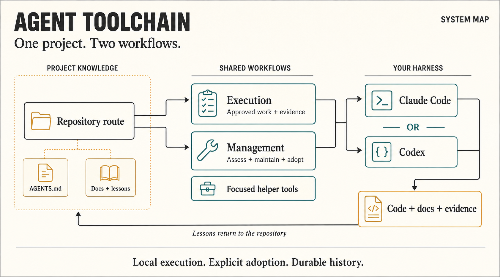
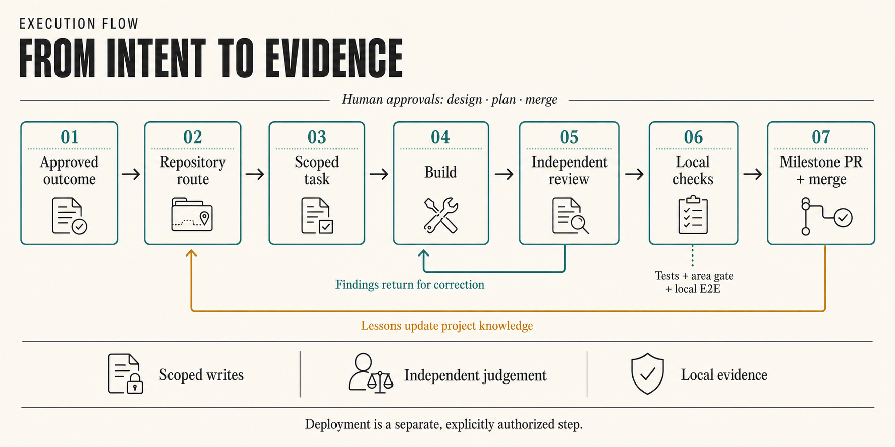
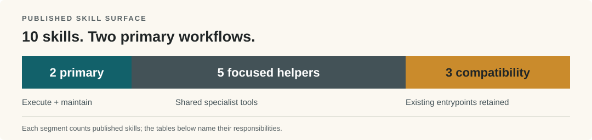

# Agent Toolchain

<p align="center"><strong>Local, inspectable guardrails for reliable Claude Code and Codex work.</strong><br>
<sub>Repository: SWE Agent · documentation and executable tooling · no hosted runtime</sub></p>

[Quickstart](#quickstart) · [Architecture](#architecture) · [Components](#components) · [Current state](#current-state) · [Documentation](#documentation)

## Overview

Agent Toolchain keeps coding-agent work grounded in the repository. It gives each project a short
context route, explicit roles, bounded execution, independent review, and local evidence that can
be rerun. Its local checks make stale routes and inconsistent generated files visible across sessions.

> [!NOTE]
> This repository ships conventions, scripts, hooks, personas, and skills. It is not a runtime,
> hosted service, deployment system, or CI platform.

## Architecture

<!-- readme-architecture-image: {"path": "docs/assets/readme/architecture.png", "sha256": "dea1af9fd1b4fc0af30f0e533808cda94e9a0e84d3c93b3bfbf95f4acbdca252", "text": "docs/assets/readme/README.md"} -->



Project knowledge supplies the contract and lessons. Work then enters one of two workflows:
ordinary delivery through **execution methodology**, or methodology maintenance through
**methodology management**. Shared helpers serve both. Claude Code or Codex produces code or
documentation plus evidence; lessons return to the project route. Agents stay in their harness.

<details>
<summary>Text equivalent for the architecture image</summary>

| Stage | Responsibility |
|---|---|
| Project knowledge | Supplies `AGENTS.md`, routed guides, approved product intent, and lessons. |
| Two workflows | Execute approved work, or explicitly assess, set up, repair, migrate, or upgrade the methodology. |
| Shared helpers | Provide personas, route validation, graph navigation, and isolated gate execution. |
| Harness | Claude Code or Codex follows the same repository-owned contract. |
| Repository result | Stores code/docs, command evidence, decisions, and durable lessons. |

</details>

## Data flow



An approved outcome moves through the route, a scoped task, build, independent review, local checks,
and milestone PR merge. Findings return to build; lessons return to the route. Founder approval
remains at design, plan, and merge. Deployment is a separate, authorized action.

## Components



| Surface | Published skills | Responsibility |
|---|---|---|
| Primary workflows | `execution-methodology`, `methodology-management` | Deliver approved work; manage assessment, setup, repair, migration, and upgrades. |
| Supporting helpers | `progressive-disclosure`, `agent-personas`, `agent-persona-factory`, `graph-navigation`, `gate-sandbox` | Route context, define roles, derive specialists, navigate graphs, and isolate write-producing gates. |
| Compatibility / read-only routes | `project-onboarding`, `project-migration`, `project-conformance` | Preserve explicit setup and migration names; expose conformance assessment without silently starting a change. |

| Component | Entry point | Deep dive |
|---|---|---|
| Published tooling | [`install/`](install/) | [Installed inventory](docs/agents/what-gets-installed.md) |
| Repository route | [`docs/agents/`](docs/agents/) | [Progressive disclosure](docs/agents/progressive-disclosure.md) |
| Operating rules | [`docs/architecture/`](docs/architecture/) | [Operating model](docs/architecture/operating-model.md) |

### Execution or management?

| | `execution-methodology` | `methodology-management` |
|---|---|---|
| Use it for | Approved product work in an adopted project | Assessing, setting up, repairing, migrating, or upgrading the methodology |
| Owns | Gates, task lanes, independent evidence, milestone seal | Maintenance routing and separately authorized scope |
| Starts | From the repository-approved runtime and plan | By explicit maintenance intent |
| Does not imply | Push, merge, deployment, or production writes | Global install, project adoption, model activation, publication, or deployment |

## Current state

The execution methodology is **v5.1**. It has one canonical task procedure, plan admission for both
light and full lanes, fresh independent review, local evidence, and a sealed milestone before
acceptance. Eleven roles are active; three superseded or retired persona definitions remain for
compatibility.

Model assignments are a selective, local pilot. Current evidence does not establish comparative
quality, velocity, subscription efficiency, rare-defect detection, or full workflow performance.
See [measurements](docs/product/measurements.md) for the honest limits and the
[weekly record](docs/product/improvements-weekly.md) for v5.1 and earlier rationale.

## Product requirements

| Authority | Defines |
|---|---|
| [Repository contract](AGENTS.md) | Public boundaries, source authority, and verification |
| [Operating model](docs/architecture/operating-model.md) | Local-first priorities and the meaning of done |
| [Published surface](docs/README.md#what-is-published-and-what-is-not) | Deliberately shipped and excluded capabilities |
| [GitHub policy](docs/runbooks/github.md) | Storage-only GitHub, local push protection, and milestone PRs |

## Quickstart

```bash
cd install && ./install.sh && ./verify.sh
```

Then open the target project in Claude Code or Codex and give it this prompt:

> Invoke `methodology-management`. Assess this repository for adoption, show the exact proposed
> project changes first, and wait for my approval before applying them.

The compatibility name `project-onboarding` reaches the same setup procedure. Installation and
project adoption are separate decisions.

## Documentation

| Read | When |
|---|---|
| [Documentation index](docs/README.md) | Find any maintained guide in one hop |
| [Methodology management](docs/runbooks/methodology-management.md) | Choose the maintenance route and understand authorization boundaries |
| [Agent personas](docs/agents/agent-personas.md) | Inspect role, model, effort, and write restrictions |
| [Decisions](docs/decisions/decisions.md) | Read accepted rationale; history does not override current tooling |

## Working in this repository

Start at [AGENTS.md](AGENTS.md), then follow [docs/README.md](docs/README.md) to the one guide needed
for the task. Published behavior comes from `install/`; maintained sources are re-vendored rather
than edited only in their installed copy.

<details>
<summary>Contributor verification and historical notes</summary>

Run the complete local repository gate before review:

```bash
cd install && ./install.sh --dry-run && ./verify.sh
```

Report the real verdict and any skipped or environmental checks. GitHub stores code and history;
it does not validate or deploy them. Changes land through milestone pull requests with independent
review and merge commits. Current behavior lives in executable tooling and maintained guides;
superseded procedures and measurements remain in the linked decision and weekly records.

</details>

[MIT license](LICENSE) · [Visual sources and text descriptions](docs/assets/readme/README.md)
