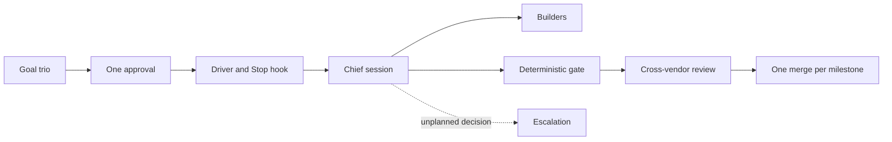
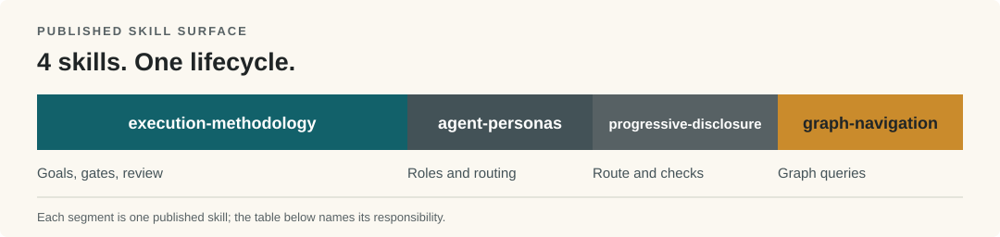

# Agent Toolchain

<p align="center"><strong>Local, inspectable guardrails for reliable Claude Code and Codex work.</strong><br>
<sub>Repository: SWE Agent · documentation and executable tooling · no hosted runtime</sub></p>

[Quickstart](#quickstart) · [Architecture](#architecture) · [Components](#components) · [Current state](#current-state) · [Documentation](#documentation)

## Overview

Agent Toolchain carries an approved goal to merged milestones with the founder involved only twice:
once to approve the goal, and once per milestone to merge it. Everything between those two points
is run by scripts and agents on one machine, and "done" is computed from git and executed commands
rather than reported in prose. A project keeps a short context route so that any session, in either
harness, finds the same contract.

> [!NOTE]
> This repository ships conventions, scripts, hooks, personas, and skills. It is not a runtime,
> hosted service, deployment system, or CI platform.

## Architecture


```mermaid
flowchart LR
  Goal["Goal trio"] --> Approval["One approval"]
  Approval --> Driver["Driver and Stop hook"]
  Driver --> Chief["Chief session"]
  Chief --> Builders["Builders"]
  Chief --> Gate["Deterministic gate"]
  Gate --> Review["Cross-vendor review"]
  Review --> Merge["One merge per milestone"]
  Chief -. unplanned decision .-> Escalation["Escalation"]
```

A goal is three documents: a spec, a design and a plan. The founder gives **one approval** for the
trio, and the **driver** then starts the **chief** session, whose **Stop hook** keeps it working
until the milestone is done or genuinely blocked. The chief dispatches **builders** inside each
task's write set and runs the **deterministic gate**: tests, scope, test-integrity and freshness
checks computed by scripts. A **cross-vendor review** by the other harness's model runs at design,
plan and acceptance. A decision the plan does not settle goes to **escalation**, which asks an
advisor once and queues anything the founder owns. Each milestone ends in **one merge**.

<details>
<summary>Text equivalent for the architecture diagram</summary>

| Stage | Responsibility |
|---|---|
| Goal trio | Spec, design and plan, each holding current decisions only. |
| One approval | The founder approves the trio and its grants together. |
| Driver and Stop hook | Start fresh sessions per milestone and keep a session working until done. |
| Chief session | The root session: plans, dispatches, commits, ticks tasks. |
| Builders | Write inside one task's write set; never approve their own work. |
| Deterministic gate | Scripts compute done, scope, test integrity and freshness. |
| Cross-vendor review | A read-only reviewer from the other vendor judges design, plan and acceptance. |
| One merge per milestone | The founder reads the explainer and merges, or sends it back. |
| Escalation | An advisor answers once; founder-owned decisions are queued, not guessed. |

</details>

## Components



| Skill | Responsibility |
|---|---|
| `execution-methodology` | The chief's rules, the goal and gate tools, the driver, read-only review, migration from v5.1 |
| `agent-personas` | Five persona sources (builder, reviewer, security-reviewer, advisor, chief) rendered per harness |
| `progressive-disclosure` | The route standard, its validator, the hooks installer, the push guard |
| `graph-navigation` | A symbol-first ladder for querying a knowledge graph |

| Component | Entry point | Deep dive |
|---|---|---|
| Published tooling | [`install/`](install/) | [Installed inventory](docs/agents/what-gets-installed.md) |
| Repository route | [`docs/agents/`](docs/agents/) | [Progressive disclosure](docs/agents/progressive-disclosure.md) |
| Operating rules | [`docs/architecture/`](docs/architecture/) | [Operating model](docs/architecture/operating-model.md) |
| Lean execution design | [`docs/architecture/lean-execution.md`](docs/architecture/lean-execution.md) | [Goal plan](docs/product/plans/F-3-lean-execution.md) |

## Current state

Methodology v6 (lean goal execution) is approved and in implementation on the
`v6-lean-execution` branch. It replaces the v5.1 task-card pipeline with three documents per goal,
a script-computed definition of done, and review only where it has measured yield. The founder's
routine touchpoints are exactly goal approval and merge per milestone; decisions the plan does not
settle are defaulted, escalated or queued, and answered asynchronously.

v5.1 is retired. A project that still carries the v5.1 runtime pin is migrated by hand with the
migration reference (`docs/runbooks/migrate-v5.md`, written in T8); until then v6
refuses to execute there. Global v5.1 files are removed only by `install.sh --retire-v5`, after
every project is migrated.

Reference points: the [spec](docs/product/specs/F-3-lean-execution.md), the
[design](docs/architecture/lean-execution.md), the [plan](docs/product/plans/F-3-lean-execution.md),
[measurements](docs/product/measurements.md) and the
[weekly record](docs/product/improvements-weekly.md). Persona routing is in
[agent-personas](docs/agents/agent-personas.md); it is an engineering choice, not a measured optimum.

## Product requirements

| Authority | Defines |
|---|---|
| [Lean execution spec](docs/product/specs/F-3-lean-execution.md) | Why, actors, acceptance criteria and non-goals for methodology v6 |
| [Repository contract](AGENTS.md) | Public boundaries, source authority, and verification |
| [Operating model](docs/architecture/operating-model.md) | Local-first priorities and the meaning of done |
| [GitHub policy](docs/runbooks/github.md) | Storage-only GitHub, local push protection, and milestone PRs |

## Quickstart

```bash
cd install
./install.sh --dry-run     # see what it would do
./install.sh               # install the four skills, hooks and personas
./verify.sh                # the repository gate
```

A plain install removes nothing. Once every project is migrated,
`./install.sh --retire-v5 --dry-run` lists exactly what retiring v5.1 would delete. Installation and
project adoption are separate decisions; see [install/README.md](install/README.md).

## Documentation

| Read | When |
|---|---|
| [Documentation index](docs/README.md) | Find any maintained guide in one hop |
| [Lean execution design](docs/architecture/lean-execution.md) | Understand the goal lifecycle, tools and review rules |
| [Founder-side instructions](docs/runbooks/global-instructions.md) | Update the private global instruction files for v6 |
| [Agent personas](docs/agents/agent-personas.md) | Inspect role, model, effort, and write restrictions |
| [Decisions](docs/decisions/decisions.md) | Read accepted rationale; history does not override current tooling |

## Working in this repository

Start at [AGENTS.md](AGENTS.md), then follow [docs/README.md](docs/README.md) to the one guide needed
for the task. `install/` is the single authored source for the published skills and hooks; edit it
there and verify with `install/verify.sh`.

<details>
<summary>Contributor verification</summary>

Run the complete local repository gate before review:

```bash
cd install && ./install.sh --dry-run && ./verify.sh
```

Report the real verdict and any skipped or environmental checks. GitHub stores code and history;
it does not validate or deploy them. Changes land through milestone pull requests with merge
commits.

</details>

[MIT license](LICENSE) · [Visual sources and text descriptions](docs/assets/readme/README.md)
