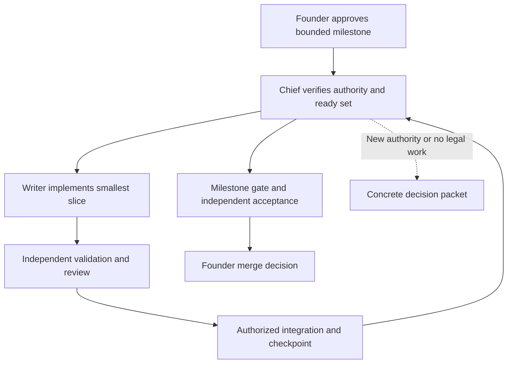

# Chief-of-staff autonomy proposal — 2026-09-30

**Status: earlier design proposal, retained as background. The [quality and velocity replan](velocity-and-quality-replan.md)
must complete its interview and design/plan reviews before implementation. Unsupported approval
adapters and a pre-rollout pilot are not required by that direction.**

The chief of staff should carry one explicit milestone decision through all routine local work.
The founder decides the outcome, material boundaries and resource envelope. The chief selects,
dispatches, repairs, validates, integrates and prepares closure until a genuine stop occurs.

## One authority record, one scheduling owner

Extend the existing plan/decision shape, not task cards or a new registry. An explicit Gate 2 record
should bind the approved plan blob, Goal Capsule, approved runtime identity and any referenced
interface/safety artifacts. Record `local_commit: allow | withhold` and resource overrides; absent
overrides retain the existing six-hour/two-builder/one-heavy-gate defaults. Record the explicit
founder decision through the current durable decision channel.

An agent-written record or hash cannot establish founder approval. The proposed evidence source is
the active root client's **host-issued interactive approval event**, correlated to a specific
request presenting the milestone, frozen input digests, grants and resource envelope. Its proposed
payload contains host issuer, root thread/request/event IDs, human-origin decision, exact presented
input digests, grants, issuance and revocation state. Generic `role: user` text in a log is insufficient.

The native host alone issues/persists that event in its protected session/event store, outside every
agent's writable roots. Agents can submit a request and read a result; they cannot select another
issuer/thread, mint a response, edit the store or grant its write permission. The checker reads the
configured host source, not an agent-selected event file. The plan/resume pointer stores only its
reference. Admission checks issuer, active root/request correlation, human origin, payload match,
expiry/revocation and store integrity. Missing, inaccessible or ambiguous evidence stops admission.

This is an explicitly proposed host-adapter contract, **not a verified capability of either current
client**. Compatibility tests must reject agent-written approvals, replay, edited plans, synthetic
`codex exec`/API user messages and cross-thread events. If the client cannot expose and enforce that
source, defer machine-proven approval admission; retain current explicit live founder decisions and
label any record-based coverage advisory. Do not invent a substitute receipt or another approval
service. Execution state is separate from frozen plan content, avoiding a self-referential hash.

Use `plan_waves.py` as the existing owner of execution admission. Planning mode remains usable for
draft plans. Execution modes check the referenced approval and report effective authority alongside
the ready set. Missing/unreadable/stale binding returns the existing could-not-answer outcome;
known prohibited operations receive an explicit finding. Do not silently change published exit
semantics. A pre-operation check is necessary: the existing `--commit REV` checks a commit after it
exists and cannot prevent an unauthorized commit.

The chief obeys observed ready membership and exclusive writes. Its replaceable resume pointer
links the authority record, referent, dirty-path owners, in-flight IDs, remaining resources, live
verdicts and next legal action. Git and existing checkers remain the authorities for progress.
No second task ledger or copy of the dependency graph is needed.

## How execution proceeds

Keep one warm chief session. Resume the same writer for its bounded correction; keep judges fresh.
Use one light task for a bounded ordinary change, with the existing complete dispatch. Use a full
card only when its defined boundary/safety conditions apply. Trivial work retains the repository's
existing direct-work exception. Councils are for research or material design uncertainty; they are
not compulsory on each task.

Prioritize the approved representative integration journey as dependencies permit. After each
accepted slice, integrate under granted local authority and refresh the pointer. Reserve closure
time from observed gate durations. A green focused suite does not substitute for the local journey
and full milestone gate.

## Continue, recover, isolate or ask

| Situation | Chief action |
| --- | --- |
| Outcome, writes, operation, ready membership, resources and host permissions cover work | Continue without asking. |
| Nonmaterial implementation choice inside frozen criteria | Pick the smallest existing pattern and record the assumption. |
| Recoverable tool/input failure | Correct its cause within scope; retry only the affected action and invalidated checks. |
| Runtime denies an action | Read the reason; use a materially safer authorized alternative when available. |
| One task blocked; other ready tasks have separate paths and safe integration | Preserve ownership and lineage; continue unrelated authorized work. |
| Missing approval, changed criteria/interface/write boundary, invalid frozen assumption, safety decision or new external permission | Stop affected work and route a concrete decision to its owner. |
| Same-cause recurrence after the permitted reviewed repair, unresolved review defect, exhausted required resource, unresolved exit 2 | Preserve evidence and stop affected work under the current rules. |
| Milestone sealed and accepted | Prepare Gate 3 once; execute only already authorized external operations. |

“Isolate” does not mean moving a failure out of view. Dirty paths remain owned; shared interfaces
and global runtime uncertainty can block all dependent work. Stop unrelated work too when its
independence cannot be established. Never reinterpret a failed or unknown gate as a pass.

## Fewer interruptions

Separate three causes: business authority, host permissions, and agent clarification. Gate 2 covers
business authority; native permission profiles and automatic review handle eligible host requests;
the chief resolves bounded choices. Each interruption records its cause and the exact missing fact
or authority, making repeated questions visible.

Batch nonurgent material decisions while legal work continues. Ask only through the root, with the
affected task, criterion, evidence, options, recommendation and consequence of deferral. Silence
never grants approval. Reuse an earlier explicit authorization while its scope and binding remain
valid, including permitted dependency/network actions; do not ask again merely because a session
compacted.

An example Gate 2 packet should offer local commit authority as an explicit choice and list exact
test commands, required registries/services, permitted recovery, resource limits and stop rules.
It should not require the founder to choose individual tasks, repair mechanics or validation order.
The existing three founder gates remain; merging them would be a separate policy proposal.

## Longer sessions and proof

Pilot native goal continuation in the available client after the milestone decision. OpenAI's
[long-running-work guidance](https://learn.chatgpt.com/docs/long-running-work) describes same-session
goals with existing permission boundaries. This does not prove crash recovery, offline continuation
or successful integration in this project; test those paths explicitly.

Start with the existing six-hour envelope. Extend it only after measuring quota, laptop/service
reliability, closure time and interruption causes. A custom unattended runner contradicts the
current loop's explicit boundary and is a later design decision if native continuation is
insufficient.

Acceptance scenarios include compaction, interrupted writer, delayed gate, stale runtime, changed
plan, overlapping dirty paths, withheld commits, denied permission, same-cause failure and a safety
finding. Target zero repeated routine approval questions after Gate 2, with independent reviews,
real local gates and observable blocked states intact.
