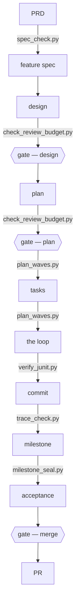

# The execution methodology

One pipeline carries product intent to a merged milestone. The canonical rules are in
[methodology.md](methodology.md); the unattended commands and branch behavior are in
[references/execution-loop.md](references/execution-loop.md). Read both before executing a plan.

## The shape, in one screen



The PRD and feature spec define the product. Design fixes structure and invariants. The plan
declares tasks. The loop implements and validates them. A commit is checked against the declaring
task, the milestone is sealed with fresh evidence, acceptance judges the frozen criteria, and the
PR is prepared for the founder.

Three human gates: the design, the plan, and the merge. Between the plan gate and merge gate, the
loop proceeds until a named stop condition occurs. The diagram is pinned to the shipped scripts by
`tests/test_shape_diagram.py`; the detailed task loop is drawn only in the loop reference.

## Admission and lanes

Every governed task must have an existing plan task id, an explicit `lane:`, a non-empty `writes:`
boundary, and acceptance criteria in `covers:`. Run `plan_waves.py` before either lane dispatches.
Missing metadata is a plan-admission failure rather than an implicit default.

- **Light lane** applies when no durable boundary or declared safety surface moves. It has no task
  card. Its inline dispatch carries the plan id, goal, criterion or invariant, observable delta,
  writes, tests, area check, persona, and report path. It still receives independent review,
  `test-judge` verification, and the named-commit write check.
- **Full lane** applies to contracts, schemas, migrations, queue shapes, public interfaces,
  generated clients, and consent, authorization, personal or health data, redaction, retention,
  audit, token, or money surfaces. It uses the strict task-card v2 pre/mid/post protocol and keeps
  every light-lane control.

A light task that reaches a full-lane boundary stops and returns to the plan.

## Reviews

Design and plan use the fresh, read-only review required by the repository methodology. A review
finding must name its frozen criterion or invariant, reachable trigger or state, observable
consequence, artifact evidence, severity, and smallest correction or human decision. `PASS` is
valid; preferences and invented requirements do not block.

Review width is scoped by stage: design and plan may use distinct lenses; the implementation stage
uses one semantic reviewer plus `test-judge`, with a safety validator when that surface moves.

The complete pre-gate and scoped-rereview contract is owned by
[methodology.md](methodology.md); this route does not restate it.

Each implementation task receives one initial full task-diff review. After a valid finding, a
writer makes one correction and a fresh reviewer performs one scoped correction review over the
persisted finding, correction, causal area, corrected artifact, and frozen criteria. There is no
semantic auto-promotion: an unresolved semantic defect closes the task as **INCOMPLETE**, never
READY. A mechanically specified final application may close only after independent executable
confirmation. Safety findings and scope changes follow their named gate and authority rules.

Run the existing workspace check before each review dispatch:

```bash
check_review_budget.py WORKSPACE_DIR --next SUBJECT
```

The check binds banned artifact classes and reports round use. A dispatch that produces no verdict
spends no round. Growth over 20% returns the changed artifact to its gate. Historical measurements
and superseded procedures are kept in
[references/history-v3-v5.md](references/history-v3-v5.md), where they are labelled as history.

## Running the method

Use `product-steward` for the PRD and feature spec, `architect` for design, and `chief-of-staff` for
the plan and bounded controller state. Cast the repository's domain validators at definition and
design. Before Gate 1 and Gate 2, use a fresh read-only `reviewer`; in Codex, freshness means
`fork_turns: "none"`. A judging persona never edits.

Freeze interfaces, including payloads, in the plan. Plans use existing/native primitives and the
smallest operationally real safe slice. The plan assigns every task a lane and write boundary.
Then follow the complete command sequence and lane branches in
[references/execution-loop.md](references/execution-loop.md).

**Executing** — hand the approved plan to `chief-of-staff`, then follow
[references/execution-loop.md](references/execution-loop.md). That reference owns the commands,
light/full branches, exit handling, review sequence, recovery state, and stop conditions.

The full-lane card schema and exact validation, JUnit, trace, sandbox, and report contracts remain
in [references/task-card.md](references/task-card.md),
[references/junit-evidence.md](references/junit-evidence.md), and
[references/codex-gate-sandbox.md](references/codex-gate-sandbox.md). A card is at most 150 lines;
prerequisites assert tree state; a wrong card is regenerated from the plan under a new id.

## Evidence and landing

Task validation runs the declared test command and area gate. `test-judge` reports the real command,
referent, exit code, and output. Full-lane JUnit evidence uses the nonce receipt contract. Coverage
uses `trace_check.py`; milestone evidence uses `milestone_seal.py`; process cost uses
`ratio_meter.py`, with `weekly_review.py` reporting its trend. `--rerun-tasks` is the only accepted
Gradle freshness proof. Process has a 10% target; the canonical method owns its warning and failure
bands. A passing gate authorizes no deployment or production write.

The maintained source is this directory. `sync_methodology.py --repo PATH` renders the canonical
method into an adopted repository; `--check` detects drift. Adoption is per repository and never
automatic. Rendering, committing, pushing, opening a PR, merging, and deploying require their own
authority.

This skill owns the sequence and terminal conditions. `agent-personas` owns models and tools;
`progressive-disclosure` owns repository routing. Spec templates live in
[references/specs.md](references/specs.md), and the README template lives in
[references/readme.md](references/readme.md).
