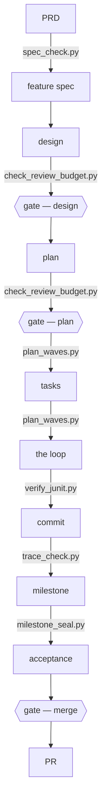

# Execute the approved methodology

Read the repository agent route. Resolve its approved inventory bundle and check runtime readiness:

```bash
python3 <approved-bundle>/execution-methodology/scripts/sync_methodology.py --repo <repo> --status-json
```

Keep the full status as tool-side evidence and report a compact state, ready, identity, and finding
summary. Governed adopted execution requires `state=current` and `ready=true`; a missing, changed,
or unverified input stops dependent work. Inspection never adopts a repository. Deferred and
unadopted repositories retain their existing contract.

## The shape, in one screen



The PRD and feature spec pass through design and plan to tasks, the loop, a commit, milestone,
acceptance and PR. The checked diagram names the high-level sequence and shipped command owners;
the per-task procedure remains solely in `references/execution-loop.md`. Three human gates: the
design, the plan, and the merge.

Load [methodology.md](methodology.md) for the mandatory common invariants, then only the role's
verified route below. Resolve every path through the inventory's `bundle_root`; do not assume a
reference sits beside a rendered guide, and do not load source and rendered copies of the same rule.

| Reader | Load after the common core |
| --- | --- |
| `product-steward` / `architect` | [references/specs.md](references/specs.md), plus the frozen product or design artifacts named by the dispatch |
| `chief-of-staff` | [references/execution-loop.md](references/execution-loop.md), plus the approved plan or Goal Capsule |
| `developer` / `senior-developer` | The complete inline light dispatch; for full lane, the validated card and [references/task-card.md](references/task-card.md) |
| `reviewer` / applicable boundary or safety validator | [references/execution-loop.md](references/execution-loop.md), Step 5, plus frozen criteria, exact task diff, and the persisted finding/correction packet for a scoped rereview |
| `test-judge` | [references/execution-loop.md](references/execution-loop.md), Step 4, the exact command and referent, and [references/junit-evidence.md](references/junit-evidence.md) or [references/codex-gate-sandbox.md](references/codex-gate-sandbox.md) when applicable |
| `acceptance` | [references/execution-loop.md](references/execution-loop.md), Step 9, plus the sealed referent and frozen acceptance criteria |

Process evidence remains common-core policy: `ratio_meter.py` measures the 10% process target and
`weekly_review.py` reports its trend. The common core owns the thresholds; these tools own their
calculations.

One semantic `reviewer` owns implementation review, with at most one relevant specialist for a
distinct invariant and `security-validator` on a safety surface. `test-judge` executes commands and
reports their real result. For Gradle, `--rerun-tasks` is the only freshness proof.

Report setup, repair, or upgrade gaps and the methodology-management invocation. Ordinary execution
does not load promotion or historical rationale, research releases, change models, install, or
re-adopt projects.
