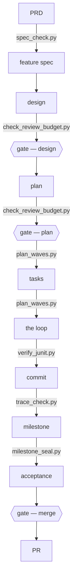

# Execute the approved methodology

Read the repository's agent route and approved execution guide, preserving its overlay and declared
authority. Resolve the approved inventory bundle, then check runtime readiness with its owning tool:

```bash
python3 <approved-bundle>/execution-methodology/scripts/sync_methodology.py --repo <repo> --status-json
```

Without inventory, the global inspector may report legacy/unadopted state; it does not adopt.
Keep the full status as tool-side evidence and show a compact state/ready/identity/finding summary.

An adopted project with a missing, changed or unverified required runtime cannot proceed as
verified. A deferred or unadopted project follows its existing contract without silent adoption.

## The shape, in one screen



The PRD and feature spec pass through design and plan to tasks, the loop, a commit, milestone,
acceptance and PR. The checked diagram names the canonical sequence and shipped command owners.
Three human gates: the design, the plan, and the merge. The detailed rules and terminal conditions live in
[methodology.md](methodology.md); the controller loop lives in
[references/execution-loop.md](references/execution-loop.md).

## Load the approved runtime

The complete common rules are mandatory. Load the verified stage reference required for the work:

- Product definition/design: specs guidance and frozen product criteria/invariants.
- Controller planning/execution: execution-loop and the approved plan or Goal Capsule.
- Builder: the complete inline light dispatch or validated full card and named context recipe.
- Review: frozen artifacts, exact task diff, and finding/correction packet for a scoped rereview.
- Verification: exact command/referent plus
  [JUnit evidence](references/junit-evidence.md),
  [gate sandbox](references/codex-gate-sandbox.md), milestone evidence and `ratio_meter.py` when
  those stages apply.
- Process evidence: `ratio_meter.py` and `weekly_review.py`; the canonical methodology owns the
  10% process target and its verdict bands.

Resolve references through the approved runtime inventory and explicit bundle root, not an assumed
directory beside the rendered guide. Do not read source and rendered copies of the same rules
twice. Keep persona permissions, strict gate commands, lane boundaries, fresh read-only review,
stop states and authority unchanged. Resolve a missing input rather than inferring it.
For Gradle execution, `--rerun-tasks` is the only accepted freshness evidence; `cleanTest` is insufficient.

Review ownership remains one semantic `reviewer`, with at most one relevant specialist for a
distinct invariant, plus `security-validator` on safety surfaces. `test-judge` runs commands and
reports their real result.

**Executing** — follow
[references/execution-loop.md](references/execution-loop.md). It owns the task commands, lane
branches, review sequence, recovery state and stop conditions.

Report a setup, repair or upgrade gap and the management invocation; do not load promotion
procedures implicitly. The user invokes methodology-management separately. Do not research
releases, change models, re-adopt projects or load historical rationale during ordinary work.
