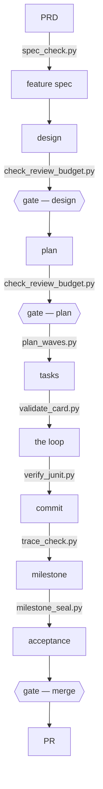

# The execution methodology

One pipeline from product intent to a merged milestone, followed identically by Claude Code and
Codex. The rules live in [methodology.md](methodology.md) — read that; this file is how to run it.

## The shape, in one screen



Each edge is labelled with the instrument that binds it, and every one of those names is checked
against `scripts/` by `tests/test_shape_diagram.py`. The per-task detail inside **the loop** is
drawn once, in [references/execution-loop.md](references/execution-loop.md), and not repeated here:
the ASCII pipeline this replaced carried four terms — budgeted review, full-diff review, sealed
receipt, process metrics — that appeared nowhere else in this file, which is what a second,
unchecked vocabulary looks like before anyone notices.

Three human gates: the design, the plan, and the merge. Between the plan gate and the merge gate the
loop runs unattended.

## Two lanes

The plan assigns every task a lane by one test: **does it cross a durable boundary** (contract,
schema, migration, queue shape, public interface) **or a declared safety surface** (consent,
authorization, personal or health data, redaction, retention, audit, tokens, money)?

- **Light lane** — the default. No card. The dispatch carries the goal, the capsule criterion, the
  write paths, the tests, and the lane's area check. One implementation review, `test-judge` on
  the gate, commit with distillation. Nothing else.
- **Full lane** — a validated card, the review budget below, one full-diff pass before the commit
  gate, sealed milestone evidence.

A light-lane task that turns out to touch a durable boundary stops and returns to the plan.

## The review budget

**Width is scoped by stage; the round budget is not.** At design and plan, up to three reviewers with
different lenses, plus `security-validator` on safety surfaces. At implementation, one reviewer plus
`test-judge`, and `security-validator` when a safety surface moves. The evidence for the stage split
is under "Design and plan" below and must not be restated here — it was restated here once already,
and one copy was corrected while this one kept the falsified rule. Two rounds per artifact: one
correction and one scoped rereview, then apply-and-close — the orchestrator applies the final
verdict's named smallest correction and closes; only safety-class findings and principle-7 scope
changes escalate, and every escalation brief names a default action executed after a short founder
wait. A dispatch that never produced a verdict spends no round. An artifact that grows more than 20% in lines
under review escalates immediately — that tripwire, the reviewer count, and the verdict form are
applied by the orchestrator at dispatch construction, as is the round budget, which it counts from
the round markers on persisted verdict filenames. The check below is authoritative for the banned
artifact classes and advisory for the count. Run it **before every review dispatch**, naming the
subject:

```bash
check_review_budget.py WORKSPACE_DIR --next SUBJECT   # exit 1: budget spent, round 3+ recorded,
                                                      # or banned artifact class present
check_review_budget.py WORKSPACE_DIR --json           # machine-readable, for the orchestrator
```

It also rejects banned workspace artifact classes — `.diff` snapshots (name the commit range; git
stores the diff), restatement packets, and files recording failed dispatches (those are one ledger
line each) — and warns when the workspace outgrows its budget, which is a process-regression
signal for the milestone receipt.

**It reads the verdict line cap** — thirty lines, the one cap of the five the methodology fixes
that no instrument used to read. `VERDICT_OVER_CAP` binds a JUDGE VERDICT only: a round-marked
prose artifact whose kind is a review, or a marker-free name that reads as a judge beyond
reasonable doubt. It never binds evidence — a fix brief, an implementation report, a scout sweep,
an analysis, a `-test-judge`, a JUnit XML, a probe log, a diff, a source file, or an artifact whose
kind the tool does not recognise. CAP THE VERDICT, NEVER THE EVIDENCE: a judge that drops a finding
to fit a line budget is a worse outcome than a long verdict, so charging an unknown kind fails
CLOSED and capping it fails OPEN. Measured on one live workspace: 51 cards averaging 85 lines with
50 of 51 inside their 150-line cap, answered by 204 verdict-class files running to 1,349 lines —
the read side was capped and the write side was not.

**The exit code binds at the push.** A pre-push hook runs this check over every review workspace it
finds and refuses the push on exit 1. That does not overturn the founder ruling in the module
docstring: the ruling is that the tool cannot bind the ORCHESTRATOR THAT RUNS IT, and git at the
push is a different party at the moment that opens the pull request the ruling itself calls the
merge gate. Every known-open bypass is inherited whole. `PD_ALLOW_REVIEW_BUDGET=1` skips it and
says so.

**Nothing is auto-granted.** A round past the cap is a decision: the subject CLOSES at its final
verdict, or a founder appends one row per exact (subject, round) to `ROUND-GRANTS.tsv`. A verdict
past thirty lines is cut, never dropped — the findings stay and the prose goes — or a
`SUBJECT<TAB>verdict:<artifact><TAB>commit<TAB>date<TAB>reason` row records that a human read that
one file and accepted its length.

**Renaming a subject resets its budget, so the check reports the FAMILY too.** Subject keys that
extend a live subject key at a token boundary (`<subj>`, `<subj>-contract`,
`<subj>-contract-prerequisite`) are one lineage, and `FAMILY_SPEND` states their combined spend
beside the per-subject lines. Measured on four real repositories: one code-formatter prerequisite
holds 13 subject keys, **51 charged artifacts across 14 distinct rounds, r1 to r15**, for one
artifact under review — and no per-subject line said so. It is a WARNING: it changes no exit code
and refuses no dispatch. Subject derivation is unchanged, so no grant key moves.

**`test-judge` does not spend a review round.** It runs a command and reports an exit code; that
is evidence collection, the same class as the JUnit XML it reports. Measured: 124 `-test-judge`
artifacts in the real corpus, 114 PASS / 2 FAIL / 1 with no verdict — 0.02 against 0.16 for
`reviewer`, and both failures have a sibling `reviewer` verdict at the same round, so no round
loses its charge. Name an artifact `-reviewer` or `-acceptance` when it actually adjudicates.

## The process-cost budget

Principle 8 says the process is measured and can fail. `ratio_meter.py` is what measures it. It
reads `git log --numstat` over a committed range and splits the churn three ways — **product**
(source, tests, build files, infrastructure), **product thinking** (specs, decision records,
architecture, runbooks, API contracts), and **process** (bookkeeping: cards, verdicts, reports,
workspace, ledger, lessons, receipts, agent instructions). Generated and vendored trees are
excluded and reported separately.

```bash
ratio_meter.py --range main..HEAD        # exit 1: process share over the ceiling
ratio_meter.py --since 2026-08-14        # any date git log accepts
ratio_meter.py --range main..HEAD --json # machine-readable, for the milestone receipt
```

Target model: **product ≥ 70%, process ≤ 10%.** Only the process ceiling reaches the exit code; the
product floor prints as an advisory line, so one number decides the verdict and there is no
argument about which one did. A breach names the five largest process files by churn, because a
budget that only scolds cannot be acted on.

**This one binds where the round count could not.** That count was reclassified advisory on the
ruling that a tool run by the party it binds cannot bind that party. Its sibling check — the
banned-artifact scan — still binds, because what is on disk is a fact about a directory rather than
a claim by its author; only the round count lost its standing as a control.
This meter reads committed history instead, so the product side of the ratio cannot be inflated
without committing product code. Two ways to pass, both of them the thing the budget wants.

A commit that **only deletes** bookkeeping is reported as `cleanup` and can never breach. Removing
bookkeeping is the budget being repaid; a meter that punished it would argue against its own
purpose. Deleting bookkeeping alongside other work is ordinary process churn.

`weekly_review.py` is the cadence, and it is a report rather than a gate — a degrading trend exits
0. The failure principle 8 exists to catch is a slope, not a single bad day: no individual week
breaches while the ratio moves by an order of magnitude.

```bash
weekly_review.py --repo PATH --weeks 8                  # one repository
weekly_review.py --repo PATH --repo PATH --weeks 8      # portfolio roll-up
```

Per ISO week it prints product / product-thinking / process lines, the process share, and a
PASS/BREACH marker; then a trend verdict per repository from the last three weeks against the
previous three. It imports the classifier from `ratio_meter.py` rather than restating it.

## Where it lives, and why in two places

The source is `methodology.md` here. `sync_methodology.py --repo PATH` renders it to
`<repo>/docs/agents/execution/methodology.md`.

Both copies are needed, and for a specific reason: **skills reach one harness; a routed markdown
file in the repository reaches every agent.** Codex has no Skill tool, so anything that lives only
here is invisible to half the fleet — and invisibly so, because the other harness never announces
what it did not read. The rendered file is the one that binds.

```bash
sync_methodology.py --repo PATH          # render into a repository
sync_methodology.py --repo PATH --check  # exit 1 when stale or hand-edited
```

The rendered file carries a version marker; `validate_disclosure.py` reads it and reports drift.
A repository binds the abstract stages to its real commands in
`docs/agents/execution/overlay.md`, which is appended at render time. That overlay is where "run
the lane's area check" becomes an actual command.

## Adoption is staggered, and never automatic

Repositories come under this methodology **one at a time, on purpose**. Nothing here renders into a
repository on its own: a hook that silently wrote the methodology into every project is exactly how
three projects end up running three methodologies, each convinced it is the standard.

Until a repository has adopted it, it says so at every session start:

```bash
sync_methodology.py --repo PATH --adoption-check   # always exits 0 — it informs, it never blocks
```

Four states, and only three of them say anything:

| State | What it prints |
| --- | --- |
| adopted and current | nothing at all |
| adopted but stale | the rendered path and the re-render command |
| deliberately deferred | one line: the reason, and how long it has been deferred |
| unadopted | the adopt command, and how to record a deferral instead |

`--check` remains the gate mode — it is the one that exits non-zero. `--adoption-check` runs from
the SessionStart reporter, wired there by `progressive-disclosure/scripts/install_hooks.py`, so
adopting the shared standard is what turns the warning on.

**Deferring deliberately.** A repository that is not ready records the decision in its own routed
index, `docs/agents/README.md` — the same file, and the same single-line JSON comment shape, that
carries the `agent-personas` base-only decision:

```
<!-- execution-methodology: {"mode":"deferred","reason":"<one line: why not yet>","date":"YYYY-MM-DD"} -->
```

The reason must be non-empty and the date must be a real one. A marker without them is not a
decision, and the check reports the repository as unadopted and says why. The date is what makes a
deferral age visibly instead of quietly becoming permanent.

**There is no registry.** No file anywhere lists which projects have adopted this. Every repository
declares its own state and the check is evaluated against the repository it is invoked on — which is
both a privacy property (this toolchain carries nothing about the repositories it serves) and a
correctness one (a central list is a second source of truth that drifts).

## This skill is user-invoked, in both harnesses

`writes:` declares authority to CHANGE a file. Nothing here declares authority to ADVANCE A STAGE.
A model may choose *how* to work; it may not authorise its own **promotion** — and the description
at the top of this file is itself a model trigger on the one skill that holds every stage gate. So
this skill is reached by a person naming it, never by a model deciding it is time.

Two switches, one per harness, and **they are not the same mechanism**:

| harness | mechanism | effect |
| --- | --- | --- |
| Claude Code | `disable-model-invocation: true`, in the front matter above | the model cannot load this skill on its own; `/execution-methodology` still works |
| Codex | `agents/openai.yaml` → `policy.allow_implicit_invocation: false` | Codex will not invoke it implicitly; `$execution-methodology` still works |

**The asymmetry is stated, not hidden.** `disable-model-invocation` is a Claude Code extension and is
absent from the Agent Skills spec; OpenAI's own Claude-to-Codex migration reference lists it as
*"No direct equivalent — Unsupported"* and calls `policy.allow_implicit_invocation` *"similar
intent, not equivalent semantics"*. Set only the front-matter key and this gate would be enforced in
one harness and inert in the other, inside a methodology whose first line is that it is followed
identically by both. Hence the sidecar file. If a harness ever ignores its own key the gate is inert
*there*, and **no front matter can tell you that** — the only evidence is a human noticing a model
starting a stage unprompted. There is deliberately no checker: "the field is present" is green the
moment the field exists and learns nothing.

**Why the field is safe here at all.** `install.sh` **copies** these directories into
`~/.claude/skills` and `~/.codex/skills`; it does not **package** them. The packaged-skill
front-matter allowlist is `name` / `description` / `license` / `compatibility` / `metadata` /
`allowed-tools`, and `disable-model-invocation` is not in it. Add a packaging or upload step to this
repository and that field becomes a hard error, not an ignored key. (`argument-hint` is in the same
forbidden set and appears nowhere in this repository. Keep it that way.)

## Running it

**Starting something new** — invoke `product-steward` for the PRD, then the feature spec. Do not skip
to design because the feature seems small; skip to a *short* spec instead. The scope boundary, the
surface, and the horizontals pass are where specs are actually incomplete, and they are cheap to
write and expensive to discover. Cast the repository's own domain validators HERE, not at review:
a validator that declares `covers:` is required in the document's `reviewed_by:` by `spec_check.py`
rule F whenever the horizontals say that concern moves. `spec_check.py --personas` shows the pool,
what each owns, and what the corpus offers it to own. Both artifacts are updated in place: a spec states what is true now
and never what it used to say.

**Design and plan** — `architect` for the design; `chief-of-staff` for the plan, with `migration-validator`
on anything crossing a durable boundary. **Review width is scoped by STAGE, not capped by a count.**
At design and plan a PANEL is correct: up to three reviewers with DIFFERENT lenses, plus
`security-validator` on safety surfaces. At implementation the width is ONE reviewer plus
`test-judge`, and `test-judge` does not spend a review round because it runs a command and reports
an exit code. After any specialist review and before each human gate, cast the existing `reviewer`
in design mode before Gate 1 and plan mode before Gate 2, under the review budget.

*This corrects the rule that used to stand here, which capped review at one specialist and
forbade a panel at every stage. The corpus falsifies it.* Measured
across 1,051 round-marked review artifacts in four repositories: a design or plan review returns a
blocking verdict at **0.74** per artifact against **0.09** at implementation — an **8x** gap, and it
holds at every width. Panel findings are not redundant: of 21 groups where two or more reviewers
blocked, the median overlap between the anchors they cite is a Jaccard of **0.20**, and the three
pairs above 0.5 share only the subject id. Three reviewers on one design returned three DISJOINT
defects. An independent re-measurement of the same repositories on a coarser stage split reproduces
the direction and not the magnitude — design 0.39-0.42 per artifact against implementation 0.16,
about 2.5x — so treat 8x as the upper end of the range and the ORDERING as the finding.

**Do not import the published "two reviewers is optimal" number.** It measures the same lens applied
twice to a diff, where a third reader adds overlap. A design panel applies different lenses to a
document, and the overlap was measured here and is low. Where the external result and this corpus
disagree, this corpus wins, and the reason is that the two are not measuring the same thing.

**Cast a domain validator EARLY, at definition and design, not at implementation review.** Across
the same repositories, project-local domain validators cast at implementation returned **66 reviews
and ZERO blocking verdicts**; the same validator names cast inside a design workspace returned
**6 blocks in 14 reviews**. A validator is a lens on a decision, and by implementation the decision
has already been made.

Freeze interfaces in the plan *including payloads*. A plan that freezes route names but not request and response shapes hands the
implementer an invention it will make silently. The plan also assigns each task its lane.

**Pre-gate adversarial review** — give a fresh, isolated, read-only `reviewer` only named artifact
paths, never the author conversation or rationale. It actively tries to falsify the artifact against
the frozen criteria and invariants. `PASS` is valid; there is no finding quota. A blocking finding
names the frozen criterion or invariant, a reachable trigger or state sequence, the observable
consequence, artifact evidence, severity, and the smallest correction or human decision.
Preferences, speculative future hardening, and invented requirements are non-blocking.

Freshness is a dispatch property. In Codex, dispatch the pre-gate review and scoped rereview with
`fork_turns: "none"`; another harness must use its equivalent fresh-thread primitive. Prompt wording
alone does not establish isolation. A post-code reviewer dispatch defaults to Implementation unless
Design or Plan is explicitly named, preserving existing implementation-review callers.

The author gets one correction and one scoped rereview. Its dispatch names the persisted original
finding or report path, correction or diff path, corrected artifact path, and governing frozen
artifact paths; it never includes author conversation or rationale. Persisted verdicts are named
`<subject>-r<N>-<kind>.md` — the round marker is what the budget check counts. If a safety-class or scope-change
cause recurs, stop: Design recurrence returns to Gate 1; plan recurrence returns to Gate 2; any
other refusal is closed by applying the final verdict's named smallest correction. The reviewer
never authors or applies its own correction, and the bounded rereview never becomes a consensus
loop. Existing implementation review is unchanged.

**Executing** — hand the approved plan to `chief-of-staff`. The loop it runs — resume, select,
dispatch, drift, validate, review, commit check, deferrals, coverage, seal, with the command and
the exit-code handling for each step, who is cast where, and what stops it — is
[references/execution-loop.md](references/execution-loop.md). Two properties bind everything in it:
status is derived from `git` by `plan_waves.py --since`, never read back from the ledger, and the
orchestrator writes nothing but the ledger, the cards and the reports.

**A report is not a request.** Milestone reports inform; they do not pause the loop. Before
stopping, name the decision — if it is not one of the three gates, a spend, an irreversible or
outward-facing action, or a genuine fork, there is nothing to ask, so proceed and say so in the next
report. "Confirm I should carry on with what we agreed" is not a decision.

Superpowers' `subagent-driven-development` is a good implementation of the same loop and its
workspace scripts are worth using. Two corrections when you do: its prompt templates dispatch
`general-purpose` subagents, which carry every tool — so a "task reviewer" can edit the code it just
judged, which silently destroys the one guarantee the persona pool enforces by restriction. Cast
from the persona pool instead. And its plan workspace is disposable scratch; the program ledger is
not. See the ledger section in `methodology.md`.

## The task card (full lane only)

The card is the implementer's entire world — it does not read the plan, and it reads nothing the
card does not name. The schema and a worked example are in
[references/task-card.md](references/task-card.md).

A card is **150 lines or fewer**, and a `frozen_values` entry longer than ten lines moves to a
committed contract file the card names by path — the validator warns on both, and `--strict` (the
gate mode) fails them. Prerequisites assert tree state, not git history. A wrong card is
regenerated from the plan under a new id — never patched, never versioned by filename.

**Validate the card before dispatching it:**

```bash
validate_card.py CARD_PATH --repo REPO_ROOT            # exit 1 on any ERROR
validate_card.py CARD_PATH --repo REPO_ROOT --strict   # exit 1 on warnings too
validate_card.py CARD_PATH --repo REPO_ROOT --phase mid            # mid-task, every turn boundary
validate_card.py CARD_PATH --repo REPO_ROOT --strict --phase post  # after implementation
```

`--phase mid` is the one mode meant to be run repeatedly. It compares every uncommitted path in the
repository against the card's `exclusive_writes` and `forbidden_paths`, with the same glob
intersection `plan_waves.py` uses on a commit — so drift is caught while the edit still reverts for
free instead of after it is in history. Measured on 56 real cards matched to their own commits: of
558 files compared, 116 were written outside what the card allowed, across 25 of the 56 cards. The
comparison is one `git status`, 19–39 ms on four real repositories.

A card asserts that certain paths and tests exist, and everything downstream trusts it. The first
card written under this methodology was wrong three times — most seriously, its `validation` block
named a test class that did not exist, and the build tool silently ignores a filter matching nothing
and reports success. That line claimed to prove an invariant while executing zero tests. None of
those errors is a judgement call; all of them are a script.

Two fields carry most of the value:

- **`context_acquisition`** is a numbered recipe the agent *runs*, not prose it reads. Inline what
  must be verbatim (signatures, payload shapes, event names, formats); retrieve what is stateful
  (branch, ledger head, index freshness).
- **`gate_risk`** names the bookkeeping artifacts the task touches — contracts, manifests,
  taxonomies, inventories, registries. Those are what fail an hour into a full gate run, and naming
  them lets the task check them in thirty seconds instead.

Java tests are declared in `tests` as exact path/class pairs (`Create: path/Test.java :: fqcn` or
`Retain: path/Test.java :: fqcn`). Exact Java Gradle `--tests` class selectors and declarations are
one-to-one; prose cannot substitute for either side.
`--phase pre` (the default) permits an owned `Create` path to be absent; `--phase post` requires the
same declaration to exist, declare the expected package and top-level class, and contain a JUnit
test, so the card is never relabelled during its life. Selectors and rerun protection must occur in
the same direct Gradle `argv`; only `argv[0]` identifies the executable, so another argument cannot
lend Gradle evidence. `--rerun-tasks` is the only accepted Gradle freshness proof. `clean`,
`cleanTest`, qualified clean tasks, exclusions, properties, option operands, and every other token
do not count. An active v2 card that used a clean task as freshness evidence must add the exact
`--rerun-tasks` member; historical cards are not rewritten.
Pre phase also permits an absent `exclusive_writes` entry only when it is a safe, exact,
repository-relative file literal. Post phase requires every write path and every Java declaration
to exist. This deliberately defers an indistinguishable new-file typo to the mandatory post check;
globs, metacharacters, directories, absolute paths, and escapes never receive that exception.
An absent safe exact `forbidden_paths` literal has the opposite meaning: it proves the fenced path
is absent and is clean in both phases. Existing forbidden boundaries are also valid, provided they
do not overlap `exclusive_writes`. When frozen migration text repeats a higher version paired to an
exact forbidden migration path, that repetition is fencing evidence rather than stale intent.

Every `validation` entry is one mapping with exactly `cwd` and `argv`. `cwd` is `.` or an existing,
normalized repository-relative directory with no symlink component; `argv` is a non-empty sequence
of non-empty strings.
There is no shell layer, grouping map, or legacy string form: pipelines, redirects, environment
assignments, and compound commands must be expressed as separate direct validation entries or moved
to a repository script with a shebang. The rejected shell basenames are exactly `sh`, `bash`,
`dash`, `zsh`, `ksh`, `mksh`, `csh`, `tcsh`, `fish`, `ash`, `pwsh`, `powershell`, `cmd`, and
`cmd.exe`. Literal shell-looking arguments remain ordinary data; unlisted wrappers are direct
processes but never lend nested executable evidence.
When `argv[0]` contains `/` and is not absolute, it resolves from `cwd`, must remain inside the
repository, and must name an executable regular file. Direct text scripts must start with a
byte-zero `#!` shebang; executable binary files are accepted. Bare PATH names remain intentionally
unchecked and absolute executable behaviour is unchanged. A command-root failure invalidates that
entry once, before dependent evidence checks run.

Nested Java selectors normalize `$` to `.`, but only an exact member-type chain found in the
containing source after comments and strings are removed establishes existence. Capitalization is
never evidence. An exact owned `Create` declaration may establish the pre-phase expectation; post
phase requires the complete declared chain in source. Nested declarations use the containing outer
source path and the full nested FQCN.

This is **task-card validation contract v2**. v1 cards are invalid under v2 because their validation
items are strings; v2 cards are invalid under v1 because the old validator flattens mappings rather
than decoding processes. Migrate each scalar by moving a leading working-directory change into
`cwd` and writing the executable plus arguments as `argv`; split multiple processes into separate
entries or move their orchestration into a directly invoked repository script. Revalidate the
unchanged card in both phases after migration.

For Gradle/JUnit evidence, use the single-use nonce-receipt protocol in
[references/junit-evidence.md](references/junit-evidence.md): `start_junit_run.py` immediately
before the test task, `verify_junit.py` after, with the canonical invocation in
`references/task-card.md`. The reference also states what the evidence does and does not detect,
its trust boundary, and how `trace_check.py` reads that same evidence to diff the criteria a spec
requires against the ids a verified run actually carried — which proves a test with that id ran and
passed, and never that it asserts anything.

Because renaming an already-green test satisfies that check for free — 0 of 5,866 real `@Test`
methods carry a criterion id today, so the migration IS a bulk rename — pass `--commit RANGE` when
sealing a milestone. T7 then requires that an id which arrived in that range sits on a test whose
body the range also changed. It proves the body changed, not that it asserts anything, and it
prints how many ids were older than the range and therefore not judged.

A read-only Codex `test-judge` never runs a write-producing gate against the source referent; the
standalone-copy nested-sandbox protocol is in
[references/codex-gate-sandbox.md](references/codex-gate-sandbox.md).

## Spec templates

[references/specs.md](references/specs.md) holds the PRD and feature-spec skeletons, the
current-state rule that governs both, and the acceptance-criteria form that turns into test names
without translation. [references/readme.md](references/readme.md) holds the repository README
template, whose first job is to state what is true today, including what is not shipped.

## What this does not decide

Who runs, on which model, with which tools — that is `agent-personas`. Where documents live and how
a repository routes an agent to them — that is `progressive-disclosure` and `project-onboarding`.
This skill owns only the sequence between stages and what must be true to leave one.

Committing, pushing, opening a pull request, and merging are founder decisions. The methodology
prepares them; it never takes them.
