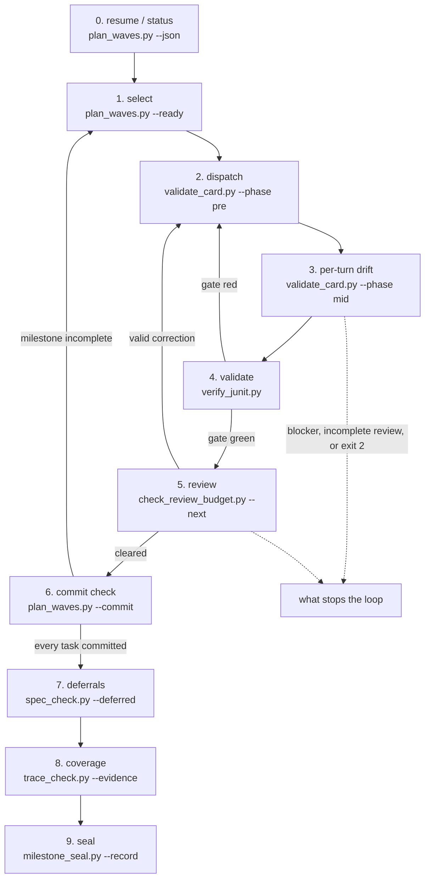

# The chief-of-staff operating loop

This is the executable procedure between the plan gate and merge gate. It is the only task-loop
definition. The controller follows the branches below; it does not implement product changes or
judge its own work.

Every governed task enters from an existing plan task id with an explicit `lane:`, non-empty
`writes:`, and acceptance criteria. `plan_waves.py` checks those facts before selection. Commands
exit `0` clean, `1` with findings, and `2` when the question could not be asked. Exit `2` is never a
pass and is not retried without fixing the named input.

## 0. Controller writes and recovery state

The `chief-of-staff` may author plans, task cards, bounded controller state, and persisted handoffs.
Product code, tests, and behavioral documentation go to a writer. Judges remain read-only.

**Current resume pointers** are replaceable bounded controller state: active milestone, previous
seal revision, current in-flight task ids, and paths to live reports/verdicts. Status and completion
are always re-derived from git and the plan. The controller refreshes or discards this state when
the tree changes.

**Append-only decisions** are a separate durable record: founder rulings, interface distillations,
corrected assumptions, verified commands and limits, and deferrals with owners. Current resume
pointers never enter append-only decisions. This separation keeps recovery cheap while preserving
the decisions the next plan must inherit.

## 1. Resume and task status

```bash
plan_waves.py --root . --milestone M<n> --since <seal-rev> --json
```

The command reads task blocks and `git log <seal-rev>..HEAD`, resolves named commits to qualified
task ids, and reports task state plus `unclaimed_commits`. `complete` is a JSON key, not an exit
code. An unclaimed commit did not resolve to a governed plan task; it is not automatically
light-lane work and cannot mark a task done.

After compaction, crash, or interruption, run this command and reconcile only the current in-flight
ids. Findings route before new dispatch: W1-W6 return to the plan; W7 is a write-boundary failure;
an unresolved revision, invalid milestone, or missing plan task exits `2` and stops selection.

## 2. The loop



The diagram and table are two checked encodings of the same ten steps. Steps 2 and 3 branch by
lane. Step 5 contains one initial full task-diff review and, when needed, one scoped correction
review. Step 6 returns to selection while tasks remain; steps 7-9 run once per milestone.

| # | Step | Command | Cast |
|---|---|---|---|
| 0 | resume / status | `plan_waves.py --milestone --since --json` | `chief-of-staff` |
| 1 | select | `plan_waves.py --milestone --since --ready --in-flight` | `chief-of-staff` |
| 2 | dispatch | `validate_card.py --phase pre` | `developer` / `senior-developer` |
| 3 | per-turn drift | `validate_card.py --phase mid` | `chief-of-staff` |
| 4 | validate | dispatch validation + `verify_junit.py` | `test-judge` |
| 5 | review | `check_review_budget.py --next` | `reviewer` + `test-judge` |
| 6 | commit check | `plan_waves.py --milestone --commit` | `chief-of-staff` |
| 7 | deferrals | `spec_check.py --deferred` | `chief-of-staff` |
| 8 | coverage | `trace_check.py --evidence --commit` | `test-judge` |
| 9 | seal | `milestone_seal.py --record` | `chief-of-staff`, then `acceptance` |

### Step 0 — resume / status

```bash
plan_waves.py --root . --milestone M<n> --since <seal-rev> --json
```

Read the complete payload. `0` continues; `1` requires routing every finding while preserving the
status output; `2` stops until the input or plan is corrected.

### Step 1 — select

```bash
plan_waves.py --root . --milestone M<n> --since <rev> --ready --in-flight <ids> --limit N
```

The wave graph is a legality certificate. `--ready` emits tasks whose dependencies are done, whose
writes do not meet in-flight writes, and whose declared serialization partners are absent. The
command admits each chosen task into the candidate set before checking the next. `--limit` is the
operator's resource cap; no concurrency number is compiled into policy.

`0` or `1` may yield a ready set, but findings must be classified before dispatch. `deferred`
explains candidates held by dependencies, serialization, writes, or the limit. `2` stops.

### Step 2 — dispatch: Light lane

Light lane has no card. Before dispatch, match the selected id to its plan block and confirm the
explicit `lane: light`, non-empty `writes:`, and `covers:` values from the successful plan run. The
inline dispatch contains:

- plan task id, goal, criterion/invariant, and observable delta;
- exact write boundary, forbidden paths if any, tests, and area check;
- persona, named context paths, stop conditions, and writer report path.

Use `developer` for bounded work and `senior-developer` when implementation judgement is required.
If a durable boundary or safety surface appears, stop and replan as full lane. The controller tracks
the in-flight id in current resume state; it does not invent a card or a second task record.

### Step 2 — dispatch: Full lane

```bash
validate_card.py <card> --repo . --strict --phase pre
```

The controller binds the selected plan task id to a card generated from that block and verifies the
card's writes, criteria, frozen inputs, commands, persona, and stop conditions against it. `0`
admits the task. `1` means regenerate the card from the plan under a new card id. `2` means the card
or repository cannot be resolved. Never patch or widen a dispatched card.

Dispatch the card path, worktree, and report path. The task-card v2, direct argv, exact Java/JUnit,
frozen value, sandbox, and handoff contracts remain defined in `task-card.md` and its linked
references.

### Step 3 — per-turn drift

For full lane:

```bash
validate_card.py <card> --repo . --phase mid
```

This compares every uncommitted path with `exclusive_writes` and `forbidden_paths`. A boundary
failure stops the task; update the plan, rerun `plan_waves.py`, and regenerate the card if the
approved scope truly changed.

For light lane, compare `git status --short` paths with the inline write boundary at every writer
handoff and before validation. A path outside the plan task's writes stops the task and returns to
the plan. Both lanes fix an adjacent finding only when it remains inside the approved boundary and
advances a frozen criterion/invariant; otherwise record it with an owner. Safety findings are never
parked.

### Step 4 — validate

Run the task's focused tests and area gate through `test-judge`. For Java/JUnit work, create and
consume the single-use evidence pair around the actual test command:

```bash
start_junit_run.py --results <results-dir> --output <receipt>
verify_junit.py --results <results-dir> --expect <FQCN>=<N> --start-receipt <receipt> --output <evidence>
```

The writer's output is a claim; the judge's rerun is the evidence. Full lane also runs the strict
post check before review:

```bash
validate_card.py <card> --repo . --strict --phase post
```

`0` proves only what the command and receipt state. A red gate returns one bounded repair to the
writer. Repeated same-cause failure after independently reviewed repair returns to the plan gate;
it is not renamed into another attempt.

### Step 5 — review

```bash
check_review_budget.py <workspace> --next <subject>
```

Run this receipt before both semantic review dispatches. It enforces forbidden workspace artifacts
and reports round use. A dispatch that produces no verdict spends no round.

Each round uses one semantic `reviewer`, with at most one relevant specialist for a distinct owned
invariant, plus `security-validator` when a safety surface moves. `test-judge` runs commands
and is not a semantic review lens. Every task, light or full, receives one initial full task-diff
review. After a valid finding, a writer makes one correction and a fresh reviewer performs one
scoped correction review of the persisted finding, correction, causal area, corrected artifact,
and frozen criteria.

No round count creates semantic success. If the scoped review leaves an unresolved semantic
defect, record the task as **INCOMPLETE**, never READY. A mechanically specified final application
may close only after independent executable confirmation. Safety and scope findings return to
their governing authority. Do not run a duplicate full-diff review after the scoped correction.

### Step 6 — commit check

```bash
plan_waves.py --root . --milestone M<n> --commit <rev>
```

The commit subject must name the existing plan task id. The command compares every changed path
with that task's `writes` at milestone scope, which can also name another feature's owner. `0`
continues. `1` is a write-boundary failure. `2` means the revision cannot be resolved. A commit
that names no task remains unclaimed and cannot complete governed work.

### Step 7 — deferrals

```bash
spec_check.py --root . --deferred
```

This queue view exits `0`; the ordinary spec gate enforces ownership. Read it before sealing. A
finding without a destination milestone is lost scope and blocks completion.

### Step 8 — coverage

```bash
trace_check.py --root . --evidence <receipt> --commit <range>
```

The command compares declared criteria with ids in verified evidence and arms the commit-range
check for newly introduced ids. Read its printed limitations: a matching id proves a named test ran
and passed, not that its assertions are sufficient.

### Step 9 — seal

```bash
milestone_seal.py --root . --gate M<n>
milestone_seal.py --root . --record M<n>
milestone_seal.py --verify --tree <tree> --command <gate>
```

`--gate` prints the declared cross-feature command. `--record` requires a clean tree, executes the
gate against HEAD, and stores a receipt outside the repository keyed to the tree SHA. Verification
fails when no receipt binds the tree and command. `acceptance` then judges that exact referent;
committing, pushing, opening a PR, and merging remain founder decisions.

## 3. Who is cast

| Responsibility | Persona |
|---|---|
| Hold the loop and bounded state | `chief-of-staff` |
| Locate code without editing | `scout` |
| Implement bounded light work | `developer` |
| Implement judgement-heavy or full work | `senior-developer` |
| Run focused and area gates | `test-judge` |
| Review the task diff | `reviewer` |
| Review a safety surface | `security-validator` |
| Review schema, migration, or backfill | `migration-validator` |
| Judge the sealed milestone | `acceptance` |
| Reconcile route, README, and lessons | `product-steward` |

The card persona is the implementer, never a judge. A repository domain validator is cast at
definition/design for its named invariant and only joins implementation when the plan names a
distinct remaining concern.

## 4. What stops the loop

Stop the affected work for an unresolvable exit `2`, a material ambiguity the approved artifacts do
not decide, a write-boundary breach, a new durable boundary, same-cause recurrence after one
independently reviewed repair, an unresolved semantic defect after the scoped correction review, a
safety finding requiring authority, a scope change, or repeated writer failure.

A status report, an unfinished milestone, a duplicate commit, or an owned deferral does not by
itself stop unrelated ready work. Classify and route each finding. Budgets trigger human review and
never weaken a test, safety, evidence, or acceptance result.

## 5. Milestone evidence and limits

At print time, compose the founder view from the real outputs of status, trace, deferrals, seal,
process ratio, and review state. Include failures, skipped checks, unclaimed commits, criteria that
traced to nothing, and the exact referent. The existing commands are the authorities; there is no
new report generator.

This loop detects declared path overlap, named-commit drift, evidence shape, deferral ownership, and
seal freshness. It cannot detect semantic interference between file-disjoint tasks, a lying test,
or a plan that is coherent and wrong about the product. Independent semantic review and the three
human gates own those limits.
