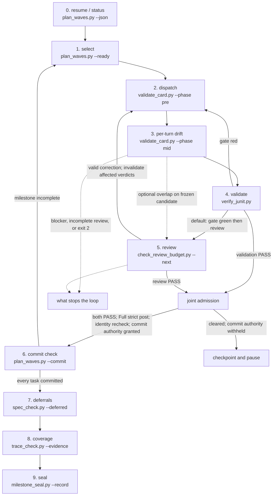

# The chief-of-staff operating loop

This is the executable procedure between the plan gate and merge gate. It is the only task-loop
definition; its causal recovery also governs technical corrections in Design and Plan without
bypassing their initial founder gates. The controller follows the branches below; it does not
implement product changes or judge its own work.

The `chief-of-staff` is the sole scheduling owner. It selects, reorders, dispatches, and records
state for only tasks in the observed ready set. When the root/controller itself holds that role, it
must not spawn a chief-of-staff child. When the role is delegated, the delegated chief sends the
root only decisions that need root action, state deltas, and artifact paths. The root relays founder
decisions and handles external approvals; it does not duplicate the delegated chief's scheduling.

Every governed task enters from an existing plan task id with an explicit `lane:`, non-empty
`writes:`, and acceptance criteria. `plan_waves.py` checks those facts before selection. Commands
exit `0` clean, `1` with findings, and `2` when the question could not be asked. Exit `2` is never a
pass and is not retried without fixing the named input.

## 0. Controller writes and recovery state

The `chief-of-staff` may author plans, task cards, bounded controller state, and persisted handoffs.
Product code, tests, and behavioral documentation go to a writer. Judges remain read-only.

**Current resume pointers** are replaceable bounded controller state: active milestone, approved
plan path, previous seal revision, source referent and dirty-path ownership, current in-flight task
ids, paths to live findings and verdicts, remaining authority and resources, and the next legal
action. Keep the pointer to about one screen and link to evidence instead of copying it. Status and
completion are always re-derived from git and the plan. Refresh or discard the pointer when the
tree changes and at accepted slice, integration, material stop, compaction, or session boundaries.

**Append-only decisions** are a separate durable record: founder rulings, interface distillations,
corrected assumptions, verified commands and limits, and deferrals with owners. Current resume
pointers never enter append-only decisions. This separation keeps recovery cheap while preserving
the decisions the next plan must inherit.

Recovery reruns the status command below, verifies the pinned runtime and Git state, reads the
complete payload, and reconciles each in-flight id with its report and dirty paths. Resume or retry
a recoverable tool input only after correcting its actual cause within Gate 2 authority; preserve
existing evidence and review lineage. This procedure does not create an unattended runner or
background relaunch.

Approved Gate 2 authority lasts through approved completion by default; elapsed hours, sleep,
compaction, session changes, and checkpoints do not expire it. An explicit founder deadline and
actual exhausted required resources still stop affected work. At every resume,
recheck scope, frozen inputs, permissions, resources, and revocation state; recheck again before an
external action. Ask the founder again only for a material scope or safety change, revocation, or
an external action outside the approved grant.

## 1. Resume and task status

```bash
plan_waves.py --root . --milestone M<n> --since <seal-rev> --json
```

The command reads task blocks and `git log <seal-rev>..HEAD`, resolves named commits to qualified
task ids, and reports task state plus `unclaimed_commits`. `complete` is a JSON key, not an exit
code. An unclaimed commit did not resolve to a governed plan task; it is not automatically
light-lane work and cannot mark a task done.

After compaction, crash, or interruption, run this command and reconcile only the current in-flight
ids. Findings route before new dispatch: W1-W6 return to the plan; W7 is a write-boundary failure;
an unresolved revision, invalid milestone, or missing plan task exits `2` and stops selection.
Inspect `unplanned` and `unclaimed_commits` in the successful status payload before autonomous
dispatch. A member feature without its required approved plan stops milestone admission until the
owning plan is complete; drafting still tolerates missing plans. Classify unclaimed output and
reconcile its ownership before selection; never treat it as accepted task completion.

Within the approved Gate 2 plan, the scheduling owner may reorder independent ready tasks, resume
or retry a recoverable tool input, return a failed check or valid review finding for a bounded fix
inside the existing write boundary, and integrate accepted work where permitted. It may make local
commits only when Gate 2 explicitly grants that operation. This autonomy does not weaken the lane,
review, safety, evidence, exit-2, or acceptance stops.

## 2. The loop


```mermaid
flowchart TD
    S0["0. resume / status<br/>plan_waves.py --json"] --> S1["1. select<br/>plan_waves.py --ready"]
    S1 --> S2["2. dispatch<br/>validate_card.py --phase pre"]
    S2 --> S3["3. per-turn drift<br/>validate_card.py --phase mid"]
    S3 --> S4["4. validate<br/>verify_junit.py"]
    S4 -- "gate red" --> S2
    S4 -- "default: gate green then review" --> S5["5. review<br/>check_review_budget.py --next"]
    S3 -. "optional overlap on frozen candidate" .-> S5
    S5 -- "valid correction; invalidate affected verdicts" --> S2
    S4 -- "validation PASS" --> ADMIT["joint admission"]
    S5 -- "review PASS" --> ADMIT
    ADMIT -- "both PASS; Full strict post; identity recheck; commit authority granted" --> S6["6. commit check<br/>plan_waves.py --commit"]
    ADMIT -- "cleared; commit authority withheld" --> PAUSE["checkpoint and pause"]
    S6 -- "milestone incomplete" --> S1
    S6 -- "every task committed" --> S7["7. deferrals<br/>spec_check.py --deferred"]
    S7 --> S8["8. coverage<br/>trace_check.py --evidence"]
    S8 --> S9["9. seal<br/>milestone_seal.py --record"]
    S3 -. "blocker, incomplete review, or exit 2" .-> STOP["what stops the loop"]
    S5 -.-> STOP
```

The diagram and table are two checked encodings of the same ten steps. Steps 2 and 3 branch by
lane. Step 5 contains one initial full task-diff review and, when needed, one scoped correction
review per causal approach through the recovery route below. Validation-first is the default;
a frozen candidate permits Steps 4 and 5 to overlap.
Joint admission requires both independent PASS verdicts, Full strict post, and identity recheck
before Step 6 or checkpoint and pause. Step 6 returns to selection while tasks remain; steps 7-9
run once per milestone.

| # | Step | Command | Cast |
|---|---|---|---|
| 0 | resume / status | `plan_waves.py --milestone --since --json` | `chief-of-staff` |
| 1 | select | `plan_waves.py --milestone --since --ready --in-flight` | `chief-of-staff` |
| 2 | dispatch | `validate_card.py --phase pre` | `developer` / `senior-developer` |
| 3 | per-turn drift | `validate_card.py --phase mid` | `chief-of-staff` |
| 4 | validate | dispatch validation + `verify_junit.py` | `test-judge` |
| 5 | review | `check_review_budget.py --next` | `reviewer` + `test-judge` |
| 6 | commit check | joint admission: validation PASS + review PASS + Full strict post + identity recheck; `plan_waves.py --milestone --commit` | `chief-of-staff` |
| 7 | deferrals | `spec_check.py --deferred` | `chief-of-staff` |
| 8 | coverage | `trace_check.py --evidence --commit` | `test-judge` |
| 9 | seal | `milestone_seal.py --record` | `chief-of-staff`, then `acceptance` |

### Step 0 — resume / status

```bash
plan_waves.py --root . --milestone M<n> --since <seal-rev> --json
```

Read the complete payload. `0` continues; `1` requires routing every finding while preserving the
status output; `2` stops until the input or plan is corrected.

### Step 1 — select

```bash
plan_waves.py --root . --milestone M<n> --since <rev> --ready --in-flight <ids> --limit N
```

The wave graph is a legality certificate. `--ready` emits tasks whose dependencies are done, whose
writes do not meet in-flight writes, and whose declared serialization partners are absent. The
command admits each chosen task into the candidate set before checking the next. `--limit` is the
remaining builder capacity for this selection, not the total concurrency allowance. Calculate
`remaining_slots = approved_builder_cap - active_builder_count`, using the actual in-flight
writers. Set `--limit` to that value; zero or negative means no new writer dispatch. The common
policy supplies the ordinary default envelope unless Gate 2 records another; no concurrency
number is compiled into this scheduler.

`0` or `1` may yield a ready set, but findings must be classified before dispatch. `deferred`
explains candidates held by dependencies, serialization, writes, or the limit. `2` stops.

Run selection against the actual selected repository root from the actual working directory, with
the intended milestone, revision, in-flight ids, and limit. Inspect the successful status payload
and selection output. Before launching a writer or expensive gate, require a non-empty ready set
and prove the chosen id is a member of that ready set; zero membership is a stop, never completed
work. Confirm actual quota, disk, memory, credentials, required services, builder slots, and
heavy-gate slots. Check remaining time and reserve closure time from observed durations only when
the founder set an explicit deadline. If that deadline or an actual exhausted required resource
prevents the task and required validation, or no safe task is ready, refresh the resume pointer
and pause affected work.

Concurrent writers receive distinct named task working trees rooted at the selected base, with
one controller owning integration. File-disjoint writes alone do not make a shared checkout safe:
the per-task dirty-path check observes every edit there. A sole writer may use the shared checkout;
unrelated sibling cards do not prove active concurrency. Declare conflicting ports, databases,
compose projects, caches, or other mutable runtime state with existing `serialises:` partners, and
keep the approved heavy-gate cap independent of builder capacity.

The approved milestone plan names an early representative integrated success journey or deny path.
Select its prerequisite slices as soon as the ready graph permits so integration evidence arrives
before the remaining milestone work can hide an interface error.

### Step 2 — dispatch: Light lane

Light lane has no card. Before dispatch, match the selected id to its plan block and confirm the
explicit `lane: light`, non-empty `writes:`, and `covers:` values from the successful plan run. The
inline dispatch contains:

- plan task id, goal, criterion/invariant, and observable delta;
- exact write boundary, forbidden paths if any, tests, and area check;
- persona, named context paths, stop conditions, and writer report path.

Use `developer` for bounded work and `senior-developer` when implementation judgement is required.
If a durable boundary or safety surface appears, stop and replan as full lane. The controller tracks
the in-flight id in current resume state; it does not invent a card or a second task record.

### Step 2 — dispatch: Full lane

```bash
validate_card.py <card> --repo . --strict --phase pre
```

The controller binds the selected plan task id to a card generated from that block and verifies the
card's writes, criteria, frozen inputs, commands, persona, and stop conditions against it. `0`
admits the task. `1` means correct the named input and regenerate the card from the plan,
preserving its stable task/card identity and causal lineage. `2` means the card or repository
cannot be resolved. Never patch or widen a dispatched card; preserve the old dispatch when a
permitted plan amendment requires regeneration and readmission.

Dispatch the card path, worktree, and report path. The task-card v2, direct argv, exact Java/JUnit,
frozen value, sandbox, and handoff contracts remain defined in `task-card.md` and its linked
references.

Both lanes use the same compact return: the writer writes the detailed report at the named path and
returns only status and that path. The report ends with at most five evidence bullets, one each for
the unproved requirement, assumption or inference, checks actually run, plausible remaining
failure, and next decisive check or action; use `none` when a category has no evidence. These are
evidence pointers, not scores and not self-acceptance or readiness claims.

### Step 3 — per-turn drift

For full lane:

```bash
validate_card.py <card> --repo . --phase mid
```

This compares every uncommitted path with `exclusive_writes` and `forbidden_paths`. A boundary
failure stops the task; update the plan, rerun `plan_waves.py`, and regenerate the card if the
approved scope truly changed.

For light lane, compare `git status --short` paths with the inline write boundary at every writer
handoff and before validation. A path outside the plan task's writes stops the task and returns to
the plan. Both lanes fix an adjacent finding only when it remains inside the approved boundary and
advances a frozen criterion/invariant; otherwise record it with an owner or request the scoped
amendment below before writing a necessary companion. Safety findings are never parked: route an
unchanged approved policy repair to its technical owner in Full lane with independent security
review; a changed policy or promise requires founder authority.

### Necessary companion-path amendment

The approved milestone envelope includes necessary companion tests, fixtures, existing callers,
and mechanical baseline cleanup within the existing feature/module seam. Before any added path
is written, the chief proposes the exact additional paths and criterion-linked reason in the
existing plan, checks dependencies, active write overlap, serialization, and forbidden paths, and
freezes that scoped amendment for a fresh independent reviewer. Include `security-validator` for
an applicable safety surface. An independent scoped PASS is required before the chief applies the
amendment, regenerates the affected card or inline dispatch, and reruns plan/card admission.
Preserve the prior dispatch, findings, and receipts; batch logical companions in one compact
amendment rather than a separate full review or founder transaction per file.

This is exact-path authority, not a blanket directory grant. It grants no unrelated refactor or
change to public contracts, schema, retention, authorization, or money behavior. An uncertain or
material expansion returns to the founder with the consequential choice. Forbidden paths still
stop work, and a write before the amendment's PASS and readmission remains a boundary violation;
a later amendment cannot retroactively authorize it.

### Step 4 — validate

The writer may run focused diagnostics while stabilizing the change. After the handoff is stable,
freeze the candidate and relevant governing inputs: bind a committed tree or the existing canonical
manifest identity, exact task diff, commands, runtime, and environment inputs in the dispatch.
Freeze only that referent's writers; unrelated task working trees may proceed. `test-judge`
performs one independent focused-and-area run. Step 5 may start on that same frozen candidate
before validation finishes; validation-first remains the default. Reuse that evidence while its source,
command, runtime, and environment remain unchanged. Rerun only after a failure or a relevant change
invalidates one of those inputs, and record the invalidation reason. If commands are batched for
transport, retain a separate receipt for each command and result; a batch-level success line cannot
stand in for them.

For Java/JUnit work, create and consume the single-use evidence pair around the actual test command:

```bash
start_junit_run.py --results <results-dir> --output <receipt>
verify_junit.py --results <results-dir> --expect <FQCN>=<N> --start-receipt <receipt> --output <evidence>
```

Ordinary tests whose writes stay in disposable temporary fixtures run through the ordinary test
route under the judge's existing permissions; disable source bytecode/cache output as needed.
Commands that write the source referent use the owning isolated-copy route in
`codex-gate-sandbox.md`. Sandbox self-tests that must invoke the sandbox from its authorized host
path use controller capture; the read-only judge independently verifies the captured command,
referent, source recheck, results, and limits. No judge boundary bypass is authorized.

The writer's output is a claim; independent judge execution or verified authorized controller
capture is the evidence. Full lane also runs the strict post check before joint admission:

```bash
validate_card.py <card> --repo . --strict --phase post
```

`0` proves only what the command and receipt state. A red gate blocks admission and returns a
bounded repair to the technical owner. Repeated same-cause failure after independently reviewed
repair changes the diagnosis or approach through causal recovery below; it is not renamed into
another attempt or treated as an automatic founder-permission request.

### Equal or stronger proof amendment

Route a verification correction to the existing proof owner and independent `test-judge`. Freeze
the proposed commands, assertion/coverage comparison, required gates, freshness, runtime and
environment inputs, and evidence identities. The judge independently confirms that the revised
proof is equal or stronger before it is admitted; the controller cannot certify its own
substitution. Preserve original failed/skipped receipts, amend the existing validation plan/card
or dispatch, rerun admission where applicable, and execute revised commands under the existing
judge permissions. Relevant source, command, runtime, or environment changes invalidate affected
PASS results; equivalence alone does not make an old receipt prove a new run.

Weaker assertions, reduced coverage, removed gates, release claims without real services, or
unprovable equivalence return to the governing authority. This route neither weakens a checker nor
grants source-write permission to a judge.

### Causal recovery in Design, Plan, and Implementation

Recovery preserves the original artifact/task, failed verdicts, and the same cause and finding
lineage in existing dispatch/recovery reports. Initial design/UX and plan approvals remain founder
gates; a substantive new design/plan choice returns to its owning gate even when approaches remain.
Within the approved outcome, a failed correction changes the diagnosis or approach instead of
repeatedly resubmitting the same repair. Each approach retains one correction and one fresh scoped
rereview; unresolved defects remain INCOMPLETE and cannot enter integration or acceptance.
Approaches A and B may revise the causal hypothesis and proof without a routine council. Concrete
evidence of reasoning complexity or a failed diagnosis may justify a stronger available model or
higher effort at either approach. A literal path, permission, or input error returns to its existing
owner for correction; it does not by itself justify model escalation or a council. After A and B
fail, before C, a targeted expert council must produce a technical replan and a fresh independent PASS must accept
that replan. If C fails, preserve the lineage, diagnosis, attempts, reviewed alternative, and
consequences for the founder; start no fourth approach. Renaming a task, attempt, fixture, or
diagnostic never resets the same cause.

At a recovery or handoff boundary, test any proposed new control by asking which approved criterion
requires it, why the existing owner is insufficient, and which delivery outcome it unblocks. The
answer changes the approach through this existing flow; it creates no new form, counter, checker,
ledger, or routine council.

### Step 5 — review

```bash
check_review_budget.py <workspace> --next <subject>
```

Run this receipt before each semantic review dispatch. It enforces forbidden workspace artifacts
and reports round use. Numeric ROUND_CAP/ROUND_BUDGET_EXHAUSTED findings are visible recovery
warnings: diagnose the cause and follow the A/B/C route, without a founder transaction solely for
the number. Preserve counts, original finding keys, legacy grant history, and output fields.
Malformed authority, forbidden artifacts, invalid identity, and evidence-integrity findings remain
hard stops. A dispatch that produces no verdict spends no round; no counter authorizes acceptance
or determines a semantic verdict.

Supply the frozen candidate identity, exact diff, and governing artifact paths. Review can
overlap Step 4 only on that stable referent and relevant inputs. A correction invalidates affected
review and validation verdicts; persist the reason and repeat only the invalidated checks through
the existing correction procedure. An earlier PASS cannot admit corrected bytes.

Each round uses one semantic `reviewer`, with at most one relevant specialist for a distinct owned
invariant, plus `security-validator` when a safety surface moves. `test-judge` runs commands
and is not a semantic review lens. Every task, light or full, receives one initial full task-diff
review. After a valid finding, a writer makes one correction per causal approach and a fresh reviewer performs one
scoped correction review of the persisted finding, correction, causal area, corrected artifact,
and frozen criteria.

No round count creates semantic success. If the scoped review leaves an unresolved semantic
defect, record the task as **INCOMPLETE**, never READY. A mechanically specified final application
may close only after independent executable confirmation. Route unresolved technical defects
through causal recovery; restore an unchanged safety policy through its technical owner and
independent security review. Changed policy or material scope returns to its governing authority.
Do not run a duplicate full-diff review after the scoped correction.

### Step 6 — commit check

```bash
plan_waves.py --root . --milestone M<n> --commit <rev>
```

Before integration, joint admission requires independent validation PASS and review PASS plus
Full lane strict post PASS. Recheck the frozen candidate and governing inputs against their recorded
tree or canonical manifest identities. Promptly transport the accepted slice into the representative
integrated journey. Recheck that the integrated task bytes match the admitted candidate. Do not
infer evidence equivalence across working trees: if integration changes relevant source or inputs,
invalidate affected verdicts and revalidate before treating the integrated slice as accepted. Use an authorized
local commit and write-set check only when Gate 2 explicitly granted that operation. When a task is
independently accepted but leaves a dirty tree and Gate 2 withheld that authority, do not create a
commit. Preserve the accepted slice and exact missing integration/seal work in the resume pointer,
then checkpoint and pause before any further selection.

The commit subject must name the existing plan task id. The command compares every changed path
with that task's `writes` at milestone scope, which can also name another feature's owner. `0`
continues. `1` is a write-boundary failure. `2` means the revision cannot be resolved. A commit
that names no task remains unclaimed and cannot complete governed work.

### Step 7 — deferrals

```bash
spec_check.py --root . --deferred
```

This queue view exits `0`; the ordinary spec gate enforces ownership. Read it before sealing. A
finding without a destination milestone is lost scope and blocks completion.

### Step 8 — coverage

```bash
trace_check.py --root . --evidence <receipt> --commit <range>
```

The command compares declared criteria with ids in verified evidence and arms the commit-range
check for newly introduced ids. Read its printed limitations: a matching id proves a named test ran
and passed, not that its assertions are sufficient.

### Step 9 — seal

```bash
milestone_seal.py --root . --gate M<n>
milestone_seal.py --root . --record M<n>
milestone_seal.py --verify --tree <tree> --command <gate>
```

`--gate` prints the declared cross-feature command. Run one final integrated gate per valid
milestone candidate. `--record` requires a clean tree, executes that gate against HEAD, and stores a
receipt outside the repository keyed to the tree SHA. Reuse the receipt while the tree, command,
runtime, and environment remain valid; rerun after a failure or relevant invalidation and record why.
Verification fails when no receipt binds the tree and command. `acceptance` then judges that exact
referent; committing, pushing, opening a PR, and merging require their existing explicit founder
grants, which do not need routine renewal while their scope and inputs remain valid.

## 3. Who is cast

| Responsibility | Persona |
|---|---|
| Hold the loop and bounded state | `chief-of-staff` |
| Locate code without editing | `scout` |
| Implement bounded light work | `developer` |
| Implement judgement-heavy or full work | `senior-developer` |
| Run focused and area gates | `test-judge` |
| Review the task diff | `reviewer` |
| Review a safety surface | `security-validator` |
| Review schema, migration, or backfill | `migration-validator` |
| Judge the sealed milestone | `acceptance` |
| Reconcile route, README, and lessons | `product-steward` |

The card persona is the implementer, never a judge. A repository domain validator is cast at
definition/design for its named invariant and only joins implementation when the plan names a
distinct remaining concern.

## 4. What stops the loop

Stop the affected work for an unresolvable exit `2`, a material ambiguity the approved artifacts do
not decide, a write-boundary breach, a new durable boundary, an unresolved semantic defect, a
changed safety policy or promise, a material scope change, an explicit deadline, an actual
exhausted required resource, or unavailable permission. Failed validation/review/safety blocks
acceptance and integration; technical repair and same-cause recurrence route through existing
owners and A/B/C recovery. After C fails, stop that recovery and return to the founder; no fourth
approach may start.

A status report, an unfinished milestone, a duplicate commit, or an owned deferral does not by
itself stop unrelated ready work. Classify and route each finding. Numeric review spend triggers
technical diagnosis and never weakens a test, safety, evidence, or acceptance result. Before a
founder request, name the actual unresolved consequential choice, options and recommendation, or
the concrete missing permission/resource or exhausted recovery. A technical issue already decided
by the approved outcome returns to its owner.

## 5. Milestone evidence and limits

At print time, compose the founder view from the real outputs of status, trace, deferrals, seal,
process ratio, and review state. Include failures, skipped checks, unclaimed commits, criteria that
traced to nothing, and the exact referent. The existing commands are the authorities; there is no
new report generator.

This loop detects declared path overlap, named-commit drift, evidence shape, deferral ownership, and
seal freshness. It cannot detect semantic interference between file-disjoint tasks, a lying test,
or a plan that is coherent and wrong about the product. Independent semantic review and the three
human gates own those limits.
