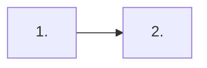

# README template

One README per repository, at the root. **Its first job is to say what is true today** — what the
repository is, what actually works, and what does not. Everything else on the page is navigation.

A README is read by someone deciding whether to trust this repository, in about ninety seconds. A
README that reads like a plan makes that decision on evidence that does not exist.

The current-state rule from [specs.md](specs.md) applies here in full: updated in place, never
appended to, never a record of what it used to claim. History is `git log -p README.md`.

---

## One hop each

**The README links the PRD. The PRD links the feature specs.** The README never lists features.

A feature list in the README has to be edited on every feature, forever, by someone whose attention
is on the feature — so it is wrong within a month, and it is the first thing an outsider reads. One
hop each keeps maintenance flat: the README changes when the *product* changes, not when a feature
does.

The same rule bans restating the PRD. Say what the product is in a paragraph, then link. Two copies
of a scope statement means one of them is out of date and neither says which.

---

## The first screen

A reader gives the page one screen before deciding. Three things go in it, in this order:

1. **One bold sentence.** What this is, for whom, and the line it does not cross.
2. **An at-a-glance table.** Four rows, no more: what it is, what you get, how to start, what it is
   not. Each cell links onward rather than explaining.
3. **The architecture visual.** Not prose. Use Mermaid or a locally committed image, including
   ImageGen output. Choose clarity and maintainability, honor the user's preference, and do not
   require both. Images follow the owning progressive-disclosure declaration contract.

Everything else follows. Order after the first screen is free; the questions are not.

**Measured, on the repository that ships this template.** Its front page ran to 4,900 words. Half
of that was a weekly changelog and 739 more were one unbroken paragraph of current state. Every
section was present and correct, and the page still could not be read. Section presence is what a
validator can check; the first screen is what a human checks, and only one of those two decides
whether the repository looks real.

---

## The seven sections

Headings may be renamed to local usage; the question each one answers may not go missing.

````markdown
# <Repository>

**<One sentence: what this is, for whom, and the line it does not cross.>**

|  |  |
|---|---|
| **What it is** | <the shape, in one line> |
| **What you get** | <the capability, in one line> |
| **How to start** | <one command, or a link to the section that has it> |
| **What it is not** | <the line it does not cross> |

## Architecture

<!-- Choose one visual form; do not require both. -->

<!-- Image alternative:  -->

Show the boxes, data direction, and protected property. Mermaid labels stay aligned with the table.
For an image, provide accessible text and provenance, and visually review semantics and private
pixels. Its declared hash identifies the reviewed file; it does not prove the picture is correct.

| Stage | What happens | What it buys |
| --- | --- | --- |
| 1. <Stage> | <one line, with the entry-point links inline> | <the value, in one line> |

## Running locally

The shortest command sequence that produces a working setup, and the requirements it assumes.

## Components

One row per component, each with a deep-dive link. The map, not the contents.

## Current state

**<Stage in two words.>**

### What ships today

| Ships | Detail |
| --- | --- |
| <Component> | <what it is, in one line> |
| <Gate> | <what runs, and its result on the current branch> |

### <One claim per subsection>

Two to five sentences, or a table when the facts are parallel. A subsection a reader can skip is a
subsection that worked.

### Not shipped

What is absent, parked, or blocked, named plainly — no deployment, no live user, the modules that
exist only as a spec, the external thing that is not created yet. This subsection is mandatory and
it is never empty. A repository with nothing false to report is a repository whose README stopped
being checked.

**Next:** one link to the current plan, and one sentence on the binding constraint.

## Product requirements

One paragraph on what the product is for, then the link: [PRD](docs/product/prd.md). The PRD
carries the feature index; this section does not.

## Working in this repository

The agent route, the branch and review rules, and where decisions are recorded.

## Recent <record name>

The newest two or three entries, each two to four sentences, each linking to its full text. Then
one link to the whole record.
````

---

## The rules that keep it true

**A record does not live on the front page.** A changelog, a weekly improvement log, a decision log
and a measurement log all accrete: entries are added and never revised. A front page is the
opposite — it states what is true now. Put the record in its own document, keep the newest two or
three entries on the front page as short summaries with links, and link the rest. Do NOT delete
old entries to shorten the page; a record that loses entries stops being a record.

Two things to check *before* the move, both of which have bitten:

- **The destination's word budget.** Routed guides are capped. A record is exempt only if the
  validator recognises its filename as a record — `measurements`, `benchmarks`, `decisions`, `adr`,
  `rulings`, `improvements`, `changelog`, `history`, with at most one `-suffix`. A record under any
  other name arrives over budget on the day it is created.
- **The record's outbound links.** A routed record links to everything it has ever touched, so its
  links join the disclosure graph. Measured: moving one changelog into `docs/` pulled the README,
  two SKILL.md files and two references into the crawl at depth 3 and 4, and put the front page
  itself under a guide budget. Keep links to already-routed documents; write deep paths into the
  code tree as code spans instead.

**Break a wall of prose into subsections.** A section carrying a dozen distinct claims in one
paragraph is a section nobody finishes. One claim per subsection, a table wherever the facts are
parallel, short sentences, and no pile-up of em-dashes. Restructuring is not culling: every claim
survives the move.

**Lead with what is false.** The not-shipped subsection is part of current state, not a footnote.
Written last, it becomes marketing; written first, it is the only part of the README that cannot be
faked by intention.

**No dates in prose that a reader must reconcile.** "Since March we have been building X" ages into a
lie without anyone touching the file. State the condition, not the elapsed time.

**Every claim is checkable.** A gate result, a count, a command, or a link. "Production ready" is not
checkable and therefore is not a claim.

**No badges.** A badge reports on a service nobody watches and renders green when the service is
gone. State the gate and the command that runs it instead.

**Blocked is a state, not a silence.** If an external thing blocks delivery, the README says so and
the PRD's off-repo blockers table carries the row. A README that omits the blocker is describing a
different repository.

**No generated status surfaces.** Committed visual assets may be generated or assisted. Do not add
a table or current-state claim built by a script that must be rerun by hand: stale output looks
live.
